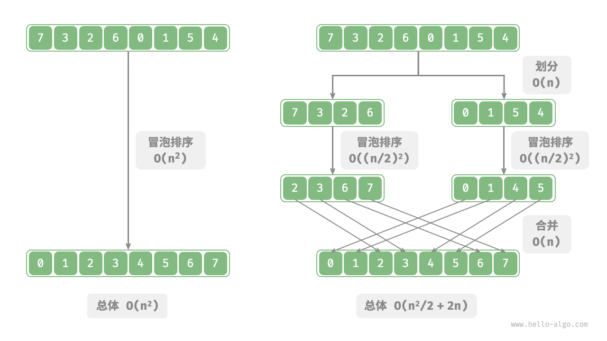
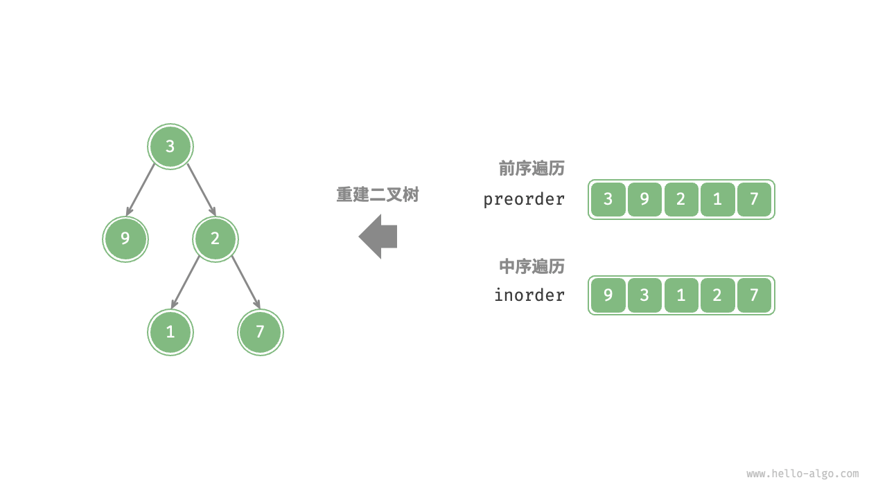
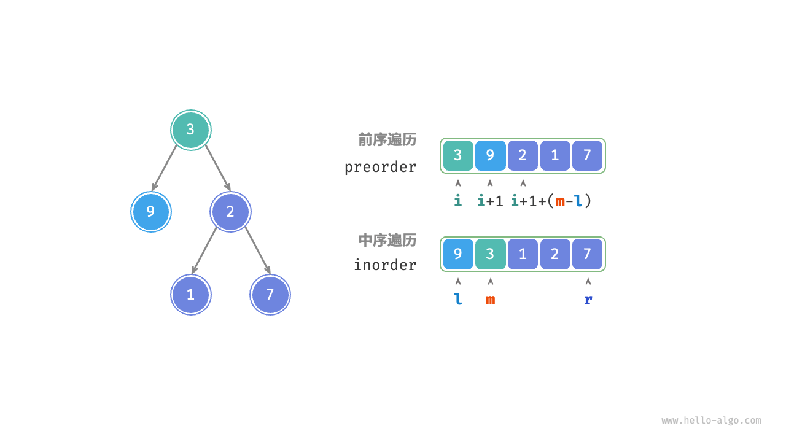
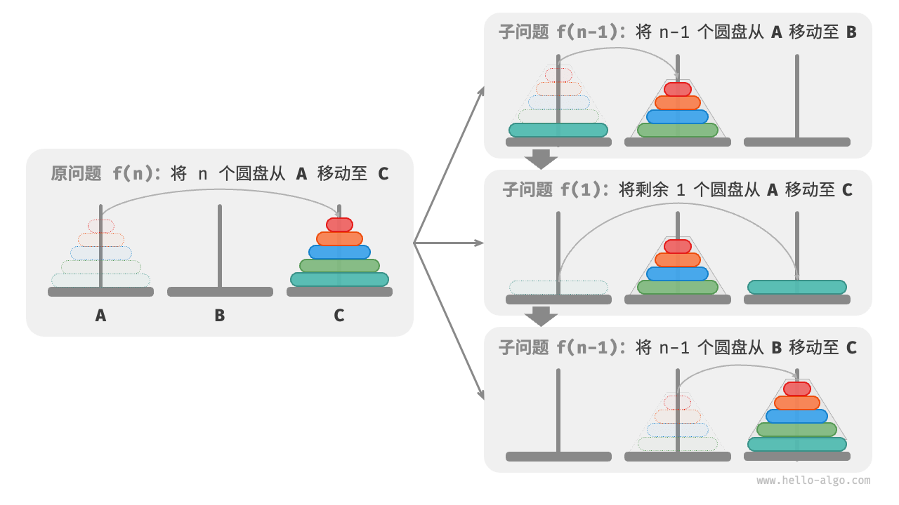
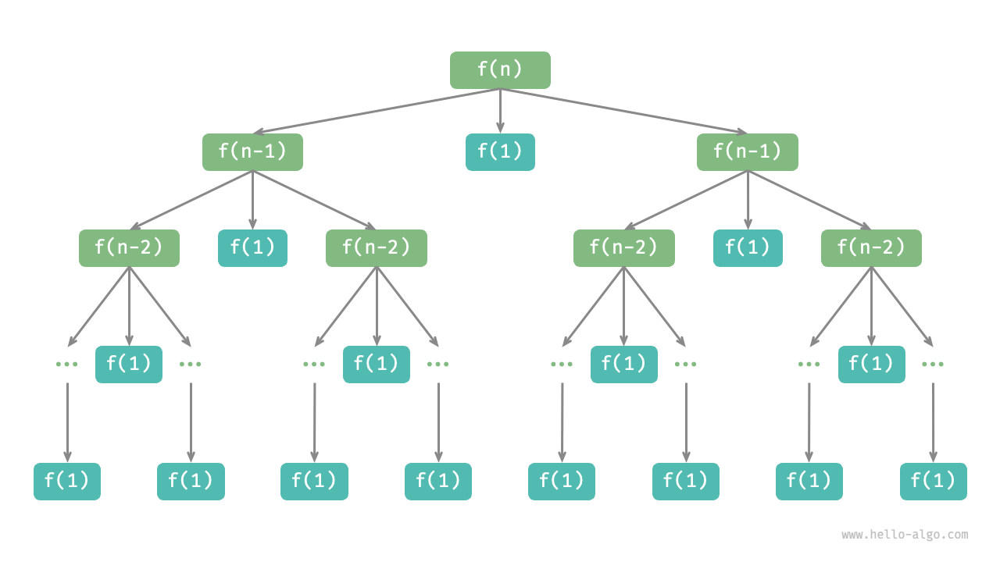

# 定义和基本概念

分治包括分和治两个阶段
1. 分：递归的将原问题划分为两个或者多个子问题，直到达到最小子问题
2. 治：从已知解的最小子问题开始，从低至顶将子问题的解进行合并，构建出原问题的解

<!-- more -->


 总操作数是O(n + n^2/2 + n) = O(n^2/2 + 2n)  

做差可证明只要n>4分解后的操作数更小  
如果一直划分直到每个子数组只剩一个元素，即为归并排序  
如果设置多个划分点，原数组平均划分成k个子数组，即为桶排序
2. 并行优化计算
分治的子问题一般独立，可以并行解决，利于操作系统的并行优化  

## 分治搜索
O(logn)的搜索通常都使用了分治策略  
如二分查找  
1. 原问题可以分解：可以把原问题分解成在一半的子数组查找
2. 子问题独立：每轮处理一个子问题，不受其他子问题影响，当区间只剩一个元素或为空时，问题就变得足够简单，可以直接判断并求解。
3. 子问题无需合并：子问题解决意味着原问题解决
下面是二分查找的递归实现，更能体现分治的特定
```java
/* 二分查找：问题 f(i, j) */
int dfs(int[] nums, int target, int i, int j) {
    // 若区间为空，代表无目标元素，则返回 -1
    if (i > j) {
        return -1;
    }
    // 计算中点索引 m
    int m = (i + j) / 2;
    if (nums[m] < target) {
        // 递归子问题 f(m+1, j)
        return dfs(nums, target, m + 1, j);
    } else if (nums[m] > target) {
        // 递归子问题 f(i, m-1)
        return dfs(nums, target, i, m - 1);
    } else {
        // 找到目标元素，返回其索引
        return m;
    }
}

/* 二分查找 */
int binarySearch(int[] nums, int target) {
    int n = nums.length;
    // 求解问题 f(0, n-1)
    return dfs(nums, target, 0, n - 1);
}
```
# 解决问题
## 构建二叉树

给定二叉树前序遍历`preorder`和中序遍历`inorder`,构建二叉树，并返回根节点  
例如  
`preorder`:[3,9,2,1,7]  
`inorder`:[9,3,1,2,7]

***

**分析**
1. 能否分治
   1. 问题可以分解：简单的可以划分为两个子问题。
      1. 构建左子树
      2. 构建右子树
      3. 当然还要加上一个操作：初始化根节点。  
      继续划分直到最小资问题（空子树）停止
   2. 子问题是独立的： 
     左子树和右子树独立无交集。构建左子树只需要关心中序遍历和前序遍历对应的左子树部分。右子树也是  
   3. 子问题可以合并：  
     得到了左子树和右子树（子问题的解），可以连接到根节点上，最终得到原问题的解
2. 如何划分子树  
   * 前序遍历：[根节点 | 左子树 | 右子树]
   * 中序节点：[左子树 | 根节点 | 右子树]
3. 一般化基于变量描述划分
    * 当前树根节点在preorder中的索引记为i
    * 当前树的根节点在inorder中的索引记为m
    * 当前树在inorder中的索引区间记为[l,r]  
    
    于是  

    |     | 根节点在preorder中的索引区间 | 在inorder的索引区间 |
    |:---:|:------------------:|:-------------:|
    | 当前树 |         i          |     [l,r]     |
    | 左子树 |        i+1         |    [l,m-1]    |
    | 右子树 |     i+1+(m-l)      |    [m+1,r]    |
    如下图：  
    

***

**实现**
为了提高查询m的效率，使用哈希表存储inorder中元素到索引的映射。

```java
import javax.swing.tree.TreeNode;

TreeNode dfs(int[] preorder,Map<Integer,Integer> inorderMap,int i ,int l,int r)
{
    //子树区间为空时终止
    if(r - l < 0)
    {
        return null;
    }
    TreeNode root = new TreeNode(preorder[i]);
    // 查询当前根节点在中序遍历的索引m
    int m = inorderMap.get(preorder[i]);
    //子问题：构建左子树
    root.left = dfs(preorder,inorderMap,i+1,l,m - 1);
    //子问题：构建右子树
    root.right = dfs(preorder,inorderMap,i+1+m-l,m+1,r);
    return root;
}
TreeNode buildTree(int[] preorder,int[] inorder)
{
    //初始化哈希表存入inorder，元素为key，索引为value
    Map<Integer,Integer> inorderMap = new  HashMap<>();
    for(int i = 0;i < inorder.length;i++)
    {
        inorderMap.put(inorder[i],i);
    }
    TreeNode root = dfs(preorder,inorderMap,0,0,inorder.length-1);
    return root;
}
```
* 时间复杂度：对于每个节点初始化一次，每个节点的操作都是O(1),因此总复杂度是O(N).[点击看常见递归复杂度分析方法](%E9%80%92%E5%BD%92%E5%A4%8D%E6%9D%82%E5%BA%A6%E5%88%86%E6%9E%90.md)
* 空间复杂度：O(n).哈希表O(n),递归调用栈在最差时树退化为链表成为O(n)


## 汉诺塔问题
给定三根柱子，记为 A、B 和 C 。起始状态下，柱子 A 上套着
个圆盘，它们从上到下按照从小到大的顺序排列。我们的任务是要把这
个圆盘移到柱子 C 上，并保持它们的原有顺序不变（如图 12-10 所示）。在移动圆盘的过程中，需要遵守以下规则。

1. 圆盘只能从一根柱子顶部拿出，从另一根柱子顶部放入。
2. 每次只能移动一个圆盘。
3. 小圆盘必须时刻位于大圆盘之上。

***

**分析**
1. 考虑基本情况f(1)  
    直接从a->c即可
2. f(2)  
   1. 最上方小圆盘a->b
   2. 大圆盘a->c
   3. 小圆盘b->c
3. f(3)  
   1. b为目标，c为缓冲，两个小圆盘a->b(执行一个f(2))
   2. 大圆盘a->c
   3. c为目标，a为缓冲，两个小圆盘b->c(执行一个f(2))  
   * 把f(3)分解成了两个f(2)和一个f(1).这说明原问题是可以分解的，子问题是独立的，解决完子问题之后解可以合并
4. f(n)  
   可以分治  
   1. n-1个圆盘a->b，借助c
   2. 1个圆盘a->c
   3. n-1个圆盘b->c，借助a
    

***

**实现**

```java
import java.util.List;

/*移动一个圆盘*/
void move(List<Integer> src, List<Integer> tar) {
    Integer pan = src.remove(src.size() - 1);
    tar.add(pan);
}

void dfs(int i, List<Integer> src,List<Integer> buf, List<Integer> tar){
    /*如果src只剩一个圆盘直接移动接口*/
    if(i == 1)
    {
        move(src,tar);
        return;
    }
    //f(i-1),先把i-1个移动到buf
    dfs(i - 1, src,tar,buf);
    //f(1),移动最上面的大的
    move(src,tar);
    //f(i-1),buf的i-1个移动到tar
    dfs(i - 1, buf,src,tar);
}

void solveHanota(List<Integer> A,List<Integer> B, List<Integer> C){
    int n = A.size();
    dfs(n,A,B,C);
}
```
* 时间复杂度：T(n) = 2T(n-1) + O(1),不满足主定理的形式，画出递归树分析  
    
    ```
                         T(n) -----O(1)的move操作
                        /    \
                    T(n-1)  T(n-1) -----O(2)的move
                            
                   
    ```
    一共n+1层，每层操作数是2^(k),k属于[0,n]  
    最终和是1+2+4……+2^n,因此时间复杂度就是O(2^n)  
    也可以选择直接展开，或者通项
* 空间复杂度：递归调用栈O(n)