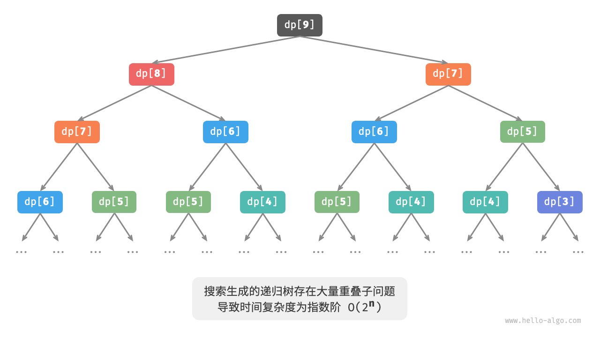

---
tags:
  - 基本算法
  - 学习笔记
aliases:
title: 动态规划
date: 2025-09-15 09:19:35
categories:
  - 基本算法
---
# 动态规划
## 定义和概念
将问题分解为一系列更小的子问题，并且通过储存子问题的解来避免重复计算，从而提高时间效率  

<!-- more -->


与回溯、分治的区别：  


* 分治递归的把原问题划分成多个**独立**的子问题直到最小问题，之后回溯中合并子问题的解得到原问题解
* 动态规划也递归分解，但是动态规划的子问题是相互依赖的，会出现重叠子问题
* 回溯算法在尝试和回退中穷举所有可能的解，并通过剪枝避免不必要的搜索分支。原问题的解由一系列决策步骤构成，我们可以将每个决策步骤之前的子序列看作一个子问题。

## 特性
1. 最优子结构   
原问题的最优解是从子问题的最优解构建得来的
2. 无后效性  
   给定一个确定的状态，它的未来发展只与当前状态有关，而与过去经历的所有状态无关   
就是说只依赖前序状态当前的已有的信息，但和前序状态时如何实现的无关

## 问题判断
**总的来说，如果一个问题包含重叠子问题、最优子结构，并满足无后效性，那么它通常适合用动态规划求解。**   
但实际上，很难直接判断，因此
1. 先观察问题是否适合使用回溯（穷举）解决（通常满足决策树模型，其中每一个节点代表一个决策，每一条路径代表一个决策序列。）
2. 之后看加分项和减分项  
   * 加分项：  
     * 问题包含最大（小）或最多（少）等最优化描述。
     * 问题的状态能够使用一个列表、多维矩阵或树来表示，并且一个状态与其周围的状态存在递推关系。
   * 减分项：
     * 问题的目标是找出所有可能的解决方案，而不是找出最优解。
     * 问题描述中有明显的排列组合的特征，需要返回具体的多个方案。

## 常规思路
1. 描述决策
2. 定义状态
3. 建立dp表
4. 推导状态转移方程
5. 确定边界条件

状态：状态由所有决策变量构成。它应当包含描述解题进度的所有变量，其包含了足够的信息，能够用来推导出下一个状态。  

dp表： 每个状态都对应一个子问题，我们会定义一个 dp表来存储所有子问题的解，状态的每个独立变量都是 dp表的一个维度。

边界条件：边界条件在动态规划中用于初始化dp表，在搜索中用于剪枝。  

状态转移方程： 递推公式  

初始状态：（如1阶2阶）最小子问题的状态

状态转移顺序的核心是要保证在计算当前问题的解时，所有它依赖的更小子问题的解都已经被正确地计算出来。

## 其他
1. 不考虑时间的前提下，所有动态规划问题都可以用回溯（暴力搜索）进行求解，但递归树中存在大量的重叠子问题，效率极低。通过引入记忆化列表，可以存储所有计算过的子问题的解，从而保证重叠子问题只被计算一次。
2. 由于当前状态仅依赖某些局部状态，因此我们可以消除dp表的一个维度，从而降低空间复杂度。
## 引入爬楼梯例题
给定一个共有 n阶的楼梯，你每步可以上 1阶或者 2阶，请问有多少种方案可以爬到楼顶？
1. 回溯穷举暴力：每轮除法上1阶或2阶，到达楼顶就方案数量加一，越过楼梯顶就剪枝
    ```java
    /* 回溯 */
    void backtrack(List<Integer> choices, int state, int n, List<Integer> res) {
        // 当爬到第 n 阶时，方案数量加 1
        if (state == n)
            res.set(0, res.get(0) + 1);
        // 遍历所有选择
        for (Integer choice : choices) {
            // 剪枝：不允许越过第 n 阶
            if (state + choice > n)
                continue;
            // 尝试：做出选择，更新状态
            backtrack(choices, state + choice, n, res);
            // 回退
        }
    }
    
    /* 爬楼梯：回溯 */
    int climbingStairsBacktrack(int n) {
        List<Integer> choices = Arrays.asList(1, 2); // 可选择向上爬 1 阶或 2 阶
        int state = 0; // 从第 0 阶开始爬
        List<Integer> res = new ArrayList<>();
        res.add(0); // 使用 res[0] 记录方案数量
        backtrack(choices, state, n, res);
        return res.get(0);
    }
    ```
2. 暴力搜索  

    得到一个结论dp[i] = dp[i-1] + dp[i-2]  
    可以直接递归，和回溯都一样属于深度优先搜索  
    ```java
    /* 搜索 */
    int dfs(int i) {
        // 已知 dp[1] 和 dp[2] ，返回之
        if (i == 1 || i == 2)
            return i;
        // dp[i] = dp[i-1] + dp[i-2]
        int count = dfs(i - 1) + dfs(i - 2);
        return count;
    }
    
    /* 爬楼梯：搜索 */
    int climbingStairsDFS(int n) {
        return dfs(n);
    }
    ```
    
    如图，递归树深度为n,时间复杂度为O(2^n)  
    
    主要原因是有很多子问题重叠了，被重复计算了。  

3. 记忆化搜索
   我们期望所有重叠子问题只计算一次  
   声明一个mem来记录每个子问题的解，搜索时重复子问题剪枝直接返回
   1. 当首次计算dp[i]时，我们将其记录至 mem[i] ，以便之后使用。
   2. 再次计算dp[i] 时，直接从mem[i]获取结果
    ```java
    /* 记忆化搜索 */
    int dfs(int i, int[] mem) {
        // 已知 dp[1] 和 dp[2] ，返回之
        if (i == 1 || i == 2)
            return i;
        // 若存在记录 dp[i] ，则直接返回之
        if (mem[i] != -1)
            return mem[i];
        // dp[i] = dp[i-1] + dp[i-2]
        int count = dfs(i - 1, mem) + dfs(i - 2, mem);
        // 记录 dp[i]
        mem[i] = count;
        return count;
    }
    
    /* 爬楼梯：记忆化搜索 */
    int climbingStairsDFSMem(int n) {
        // mem[i] 记录爬到第 i 阶的方案总数，-1 代表无记录
        int[] mem = new int[n + 1];
        Arrays.fill(mem, -1);
        return dfs(n, mem);
    }
    ```

    
   所有重叠子问题都只需计算一次，时间复杂度优化至 O(n)


4. 动态规划  
    记忆化搜索是从顶至底的方法  
    动态规划是从低至顶：从最小子问题的解开始，迭代构建更大子问题的解，直到得到原问题  
    ```java
    /* 爬楼梯：动态规划 */
    int climbingStairsDP(int n) {
        if (n == 1 || n == 2)
            return n;
        // 初始化 dp 表，用于存储子问题的解
        int[] dp = new int[n + 1];
        // 初始状态：预设最小子问题的解
        dp[1] = 1;
        dp[2] = 2;
        // 状态转移：从较小子问题逐步求解较大子问题
        for (int i = 3; i <= n; i++) {
            dp[i] = dp[i - 1] + dp[i - 2];
        }
        return dp[n];
    }
    ```
    显然dp[i]只和dp[i-1]和dp[i-2]有关，因此不必使用dp储存所有子问题的解，利用两个变量滚动即可
    ```java
    int climbingStairsDPComp(int n){
        if(n == 1 || n == 2)
        {
            return n;
        }
        int a = 1,b = 2;
        for(int i = 3;i<n;i++)
        {
            int temp = b;
            b = a + b;
            a = temp;
            //每轮结束时，b就是第dp[i]
        }
        return b;
    }
    ```
    空间复杂度降到O(1).  
    **动态规划当前状态往往仅与前面有限个状态有关，这时我们可以只保留必要的状态，通过“降维”来节省内存空间。这种空间优化技巧被称为`“滚动变量”`或`“滚动数组”`。**

## 更改爬楼梯问题说明最优子结构
给定一个楼梯，你每步可以上 1阶或者 2阶，每一阶楼梯上都贴有一个非负整数，表示你在该台阶所需要付出的代价。给定一个非负整数数组 cost，其中 cost[i]表示在第 i个台阶需要付出的代价， cost[0]为地面（起始点）。请计算最少需要付出多少代价才能到达顶部？

显然$dp[i] = min(dp[i-1],dp[i-2]) + cost[i]$  

也就是原问题的最优解是从子问题的最优解构建得来的。  

实际上原来的爬楼梯问题如果换成问"最大方案数量"的等价问法，也相当于一种最优子结构  

```java
/* 爬楼梯最小代价：动态规划 */
int minCostClimbingStairsDP(int[] cost) {
    int n = cost.length - 1;
    if (n == 1 || n == 2)
        return cost[n];
    // 初始化 dp 表，用于存储子问题的解
    int[] dp = new int[n + 1];
    // 初始状态：预设最小子问题的解
    dp[1] = cost[1];
    dp[2] = cost[2];
    // 状态转移：从较小子问题逐步求解较大子问题
    for (int i = 3; i <= n; i++) {
        dp[i] = Math.min(dp[i - 1], dp[i - 2]) + cost[i];
    }
    return dp[n];
}
```
这个dp[i]只由dp[i-1]和dp[i-2]决定，因此也可以两个变量滚动空间优化
```java
int minCostClimbingStairsDPComp(int[] cost)
{
    int n = cost.length - 1;
    if(n == 1|| n==2)
    {
        return cost[n];
    }
    int a = cost[1],b = cost[2];
    for(int i = 3;i <= n;i++)
    {
        int temp = b;
        b = Math.min(a,temp) + cost[i];
        a = temp;
        //b在每轮循环结束就是dp[i]
    }
    return b;
}
```

## 修改爬楼梯问题说明无后效性
无后效性就是说，给定一个确定的状态，问题未来的发展只与当前状态有关，而与过去经历的所有状态无关。
就是说只依赖前序状态当前的已有的信息，但和前序状态时如何实现的无关
上面的爬楼梯问题都是这样。
但如果加一个约束条件：  
`给定一个共有 n阶的楼梯，你每步可以上 1阶或者 2阶，但不能连续两轮跳 1阶，请问有多少种方案可以爬到楼顶？`  
如果上一轮是跳1阶，下一轮必须跳2阶，意味着下一步选择不能有当前状态决定，还和前一个状态有关。   
但我们可以扩展状态的定义，状态[i,j]表示在第i阶，并且上一轮跳了j阶，j属于{1,2}。这样又满足了无后效性  
则有  
dp[i,j] = dp[i,1] + dp[i,2] = dp[i-1,2] + dp[i-2,1] + dp[i-2,2]
```java
int clim(int n)
{
    if(n == 1 || n == 2)
    {
        return 1;
    }
    //初始化dp表
    int[][]dp = new int[n+1][3];
    dp[1][1] = 1;
    dp[1][2] = 0;
    dp[2][1] = 0;
    dp[2][2] = 1;
    //状态转移
    for(int i = 3;i<=n;i++)
    {
        dp[i][1] = dp[i - 1][2];
        dp[i][2] = dp[i-2][1]+dp[i-2][2];
    }
    return dp[n][1]+dp[n][2];
}
```
上面的可以通过扩展状态定义满足无后效性  
但是有时候会有无法做到
`给定一个共有 n阶的楼梯，你每步可以上 1阶或者 2阶。规定当爬到第 i阶时，系统自动会在第 2i阶上放上障碍物，之后所有轮都不允许跳到第 2i阶上。例如，前两轮分别跳到了第 2、3 阶上，则之后就不能跳到第 4、6 阶上。请问有多少种方案可以爬到楼顶？`
这个问题每次的跳跃都会影响未来的跳跃

## 表格问题
先判断问题能否回溯，之后根据加分减分可以尝试是否使用动态规划

`给定一个n*m的二维网格 grid ，网格中的每个单元格包含一个非负整数，表示该单元格的代价。机器人以左上角单元格为起始点，每次只能向下或者向右移动一步，直至到达右下角单元格。请返回从左上角到右下角的最小路径和。`

**分析**
1. 思考每轮决策，定义状态得到dp表  


    本题每轮决策是从当前格子向下或者向右。因此状态应该包括行列索引两个变量，[i,j]  
    
    状态[i,j]对应的子问题就是：从起点[0,0]走到[i,j]的最小代价路径和，记为dp[i,j]  
    
    


2. 找出最优子结构进而推导状态转移方程 
    
    dp[i,j]=min(dp[i-1,j],dp[i,j-1])+grid[i,j] (grid[i,j]是[i,j]处格点的代价)
3. 确定边界条件和状态转移顺序 
    
    首行的状态只能由左边的状态得到，首列的状态只能由上班的状态得到。因此i=0,j=0就是边界条件

    如图 14-13 所示，由于每个格子是由其左方格子和上方格子转移而来，因此我们使用循环来遍历矩阵，外循环遍历各行，内循环遍历各列。
    
    这是为了保证计算当前解时，以来的更小子问题的解都被计算出来了  

**实现**
因为子问题分解时从顶到底的思想，所以按照 暴力搜索、 记忆化搜索 、动态规划顺序展示
1. 暴力搜索
```java
/* 最小路径和：暴力搜索 */
int minPathSumDFS(int[][] grid, int i, int j) {
    // 若为左上角单元格，则终止搜索
    if (i == 0 && j == 0) {
        return grid[0][0];
    }
    // 若行列索引越界，则返回 +∞ 代价
    if (i < 0 || j < 0) {
        return Integer.MAX_VALUE;
    }
    // 计算从左上角到 (i-1, j) 和 (i, j-1) 的最小路径代价
    int up = minPathSumDFS(grid, i - 1, j);
    int left = minPathSumDFS(grid, i, j - 1);
    // 返回从左上角到 (i, j) 的最小路径代价
    return Math.min(left, up) + grid[i][j];
}
```

每个状态都能向下和向右，从左上角到右下角需要m+n-2步，所以复杂度O(2^(m+n))

2. 记忆化搜索  
引入mem记忆列表记录子问题的解并对重叠子问题剪枝
```java
/* 最小路径和：记忆化搜索 */
int minPathSumDFSMem(int[][] grid, int[][] mem, int i, int j) {
    // 若为左上角单元格，则终止搜索
    if (i == 0 && j == 0) {
        return grid[0][0];
    }
    // 若行列索引越界，则返回 +∞ 代价
    if (i < 0 || j < 0) {
        return Integer.MAX_VALUE;
    }
    // 若已有记录，则直接返回
    if (mem[i][j] != -1) {
        return mem[i][j];
    }
    // 左边和上边单元格的最小路径代价
    int up = minPathSumDFSMem(grid, mem, i - 1, j);
    int left = minPathSumDFSMem(grid, mem, i, j - 1);
    // 记录并返回左上角到 (i, j) 的最小路径代价
    mem[i][j] = Math.min(left, up) + grid[i][j];
    return mem[i][j];
}
```

引入记忆后所有子问题的解只算一次，时间复杂度O(mn)

3. 动态规划
```java
int minPath(int[][] grid){
    int n = grid.length,m = grid[0].length;//n是行数，m是列数
    int[][] dp = new int[n][m];
    dp[0][0] = grid[0][0];
    //状态转移首行
    for(int j = 1;j < m;j++)
    {
        dp[0][j] = dp[0][j - 1] + grid[0][j];
    }
    //首列
    for(int i = 1;i<n;i++)
    {
        dp[i][0] = dp[i-1][0]+grid[i][0];
    }
    //其他行列
    for(int i = 1;i<n;i++)
    {
        for(int j = 1;j<m;j++)
        {
            dp[i][j] = Math.min(dp[i][j-1],dp[i-1][j]) + grid[i][j];
            
        }
    }
    return dp[n-1][m-1];
}

```
时间复杂度：O(mn),空间复杂度O(mn)(dp表)

也可以空间优化，因为每个格子之和左边和上边的格子有关，因此可以只用一个单行数组实现dp表   （无法进一步优化，虽然对于每个格点只需要左侧和上方，左侧可以只用一个量，但是上方的对于每一行不同列的格点都不同，至少需要保存上面一整行）
但，因为数组 dp 只能表示一行的状态，所以我们无法提前初始化首列状态，而是在遍历每行时更新它：

```java
int minPath(int[][] grid){
    int n = grid.length,m = grid[0].length;
    int[] dp = new int[m];
    //状态转移:首行
    dp[0] = grid[0][0];
    for(int j = 1;j<m;j++)
    {
        dp[j] = dp[j - 1] + grid[0][j];
    }
    //状态转移其余行
    for(int i = 1;i<n;i++){
        //状态转移首列
        dp[0] = dp[0] + grid[i][0];
        //状态转移其他列
        for(int j = 1;j<m;j++)
        {
            dp[j] = Math.min(dp[j-1],dp[j]) + grid[i][j];//dp[j-1]是已经被更新的左侧的，dp[j]被更新前是上面一行同列的元素
        }
    }
    return dp[m-1];
}

```
可以把空间复杂度降到O（m)

## 0-1背包问题
给定 $n$ 个物品，第 $i$ 个物品的重量为 $wgt[i-1]$、价值为 $val[i-1]$ ，和一个容量为 $cap$ 的背包。每个物品只能选择一次，问在限定背包容量下能放入物品的最大价值。

这里物品编号从1开始所以i对于的wgt[i-1]

可以看成n轮决策组成的过程，每个物体都有不放入和放入两种决策，满足决策树模型

同时求的是最大价值，因此很可能能用动态规划

1. 思考每轮决策定义状态得到dp表

    每个物品不放入背包，背包容量不变；放入背包容量减小。

    定义状态：当前物品编号i和背包容量c。
    
    [i,c]对应子问题：前i个物品在容量为c的背包中的最大价值，记为dp[i,c]

    待求解的是dp[n,cap]，需要一个（n+1）*(cap+1)的表
2. 找出最优子结构并推出状态转移方程
   
    对i做决策时分为一下两种情况：
    1. 不放入i,则dp[i,c] = dp[i-1,c]
    2. 放入i,则dp[i,c] = dp[i-1,c-wgt[i-1]] + val[i-1]
   因此最终状态转移方程：dp[i,c] = max(dp[i-1,c] , dp[i-1,c-wgt[i-1]] + val[i-1])
3. 确定边界条件和状态转移顺序
   1. 边界：当物品或背包为0，最大价值为0.即为首行首列dp[i,0]和dp[0,c]为0
   2. 每个其他dp都要由左上方的和正上方的两个状态确定，因此通过两层正循环遍历即可
    
**实现**
1. 暴力搜索
```java
/* 0-1 背包：暴力搜索 */
int knapsackDFS(int[] wgt, int[] val, int i, int c) {
    // 若已选完所有物品或背包无剩余容量，则返回价值 0
    if (i == 0 || c == 0) {
        return 0;
    }
    // 若超过背包容量，则只能选择不放入背包
    if (wgt[i - 1] > c) {
        return knapsackDFS(wgt, val, i - 1, c);
    }
    // 计算不放入和放入物品 i 的最大价值
    int no = knapsackDFS(wgt, val, i - 1, c);
    int yes = knapsackDFS(wgt, val, i - 1, c - wgt[i - 1]) + val[i - 1];
    // 返回两种方案中价值更大的那一个
    return Math.max(no, yes);
}
```

有很多重复
2. 记忆化搜索:借助记忆列表 mem 来记录子问题的解
```java
/* 0-1 背包：记忆化搜索 */
int knapsackDFSMem(int[] wgt, int[] val, int[][] mem, int i, int c) {
    // 若已选完所有物品或背包无剩余容量，则返回价值 0
    if (i == 0 || c == 0) {
        return 0;
    }
    // 若已有记录，则直接返回
    if (mem[i][c] != -1) {
        return mem[i][c];
    }
    // 若超过背包容量，则只能选择不放入背包
    if (wgt[i - 1] > c) {
        return knapsackDFSMem(wgt, val, mem, i - 1, c);
    }
    // 计算不放入和放入物品 i 的最大价值
    int no = knapsackDFSMem(wgt, val, mem, i - 1, c);
    int yes = knapsackDFSMem(wgt, val, mem, i - 1, c - wgt[i - 1]) + val[i - 1];
    // 记录并返回两种方案中价值更大的那一个
    mem[i][c] = Math.max(no, yes);
    return mem[i][c];
}
```
时间负载的取决于子问题的数量，也就是dp表的数量，降到了O(n*cap)
3. 动态规划
```java
int knapsackDP(int[] wgt,int[] val,int cap)
{
    int n = wgt.length;
    //初始化dp表
    int[][] dp = new int[n+1][cap+1];
    //状态转移
    for(int i = 1;i <= n;i++)
    {
        for (int c = 1;c <= cap;c++)
        {
            if(wgt[i - 1] > c)
            {
                //如果超过背包容量，一定不选i
                dp[i][c] = dp[i-1][c];
            }
            else{
                dp[i][c] = Math.max(dp[i-1][c],dp[i-1][c - wgt[i-1]]+val[i-1]);
            }
        }
    }
    return dp[n][cap];
}
```
上面没有显示初始化首行首列，因为Java定义时直接所有元素为0

时间复杂度空间复杂度都是O(n*cap)
4. 空间优化
每个状态只和上一行的状态(正上方左上方）有关，因此可以两个数组滚动前进。复杂度降低到O(n)   
还能继续降低，使用一个数组。但行序需要倒叙遍历  
因为，假设只有一个数组，开始遍历第i行时，该数组储存的还是i-1行的状态
    1. 如果正序，遍历到dp[i,j]时，左上方的值已经被覆盖了
    2. 如果倒叙，不存在覆盖问题（同一行代表同一元素，对应的背包容量缩减量相同）
```java
int knapsackDPComp(int[] wgt ,int[] val,int cap)
{
    int n = wgt.length;
    int[] dp = new int[cap + 1];
    //状态转移
    for(int i = i;i<=n;i++)
    {
        //倒叙遍历
        for (int c =cap;c >= 1;c--)
        {
            if(wgt[i-1] <= c)
            {
                dp[c] = Math.max(dp[c],dp[c - wgt[i - 1] ]+ val[i-1]);
                
            }
        }
    }
    return dp[cap];
}
```

## 完全背包问题
给定 $n$ 个物品，第 $i$ 个物品的重量为 $wgt[i-1]$、价值为 $val[i-1]$ ，和一个容量为 $cap$ 的背包。**每个物品可以重复选取**，问在限定背包容量下能放入物品的最大价值。
1. 思路：核心就是可以重复选取了   
状态[i,c]分为两种情况：
    1. 不放入i：转移至[i-1,c]
    2. 放入i：转移至[i,c-wgt[i-1]]   
状态方程  $dp[i, c] = \max(dp[i-1, c], dp[i, c - wgt[i-1]] + val[i-1])$

```java
/* 完全背包：动态规划 */
int unboundedKnapsackDP(int[] wgt, int[] val, int cap) {
    int n = wgt.length;
    // 初始化 dp 表
    int[][] dp = new int[n + 1][cap + 1];
    // 状态转移
    for (int i = 1; i <= n; i++) {
        for (int c = 1; c <= cap; c++) {
            if (wgt[i - 1] > c) {
                // 若超过背包容量，则不选物品 i
                dp[i][c] = dp[i - 1][c];
            } else {
                // 不选和选物品 i 这两种方案的较大值
                dp[i][c] = Math.max(dp[i - 1][c], dp[i][c - wgt[i - 1]] + val[i - 1]);
            }
        }
    }
    return dp[n][cap];
}
```
几乎一样，只是一处i-1变为i
3. 空间优化  
   由于当前状态是从左边和上边的状态转移而来的，因此空间优化后应该对dp表中的每一行进行正序遍历。
```java
/* 完全背包：空间优化后的动态规划 */
int unboundedKnapsackDPComp(int[] wgt, int[] val, int cap) {
    int n = wgt.length;
    // 初始化 dp 表
    int[] dp = new int[cap + 1];
    // 状态转移
    for (int i = 1; i <= n; i++) {
        for (int c = 1; c <= cap; c++) {
            if (wgt[i - 1] > c) {
                // 若超过背包容量，则不选物品 i
                dp[c] = dp[c];
            } else {
                // 不选和选物品 i 这两种方案的较大值
                dp[c] = Math.max(dp[c], dp[c - wgt[i - 1]] + val[i - 1]);
            }
        }
    }
    return dp[cap];
}
```
### 零钱兑换问题

#### 一
给定 $n$ 种硬币，第 $i$ 种硬币的面值为 $coins[i - 1]$ ，目标金额为 $amt$ ，**每种硬币可以重复选取**，问能够凑出目标金额的最少硬币数量，硬币面值至少为1。如果无法凑出目标金额，则返回 $-1$ 
1. 可以看作完全背包的特殊情况
    1. 物品对应硬币，重量对应面值，背包容量对应目标金额
    2. 相反，这个要最小化硬币数量
    3. 完全背包要求是不超过背包容量，零钱兑换要求是恰好
2. 思考每轮决策，定义状态得到dp表  
    [i,a]对应的子问题：前i种硬币能凑出金额a的最少硬币数量，记为dp[i,a]  
    dp表(n+1)*(amt+1)
3. 找最优子结构状态转移方程
   dp[i,a] = min(dp[i-1,a],dp[i,a-coins[i-1]] + 1)
4. 确定边界条件和转移顺序  
    目标金额为0，数量为0，即首列都为0  
    五硬币时，无法凑出，可以记为无限大，即首行都是无限大
5. 实现
大多数语言没提供无限大，因此只能用整型int的最大值替代，但是这样+1操作可能溢出，因此采用amt+1表示无限，因为凑出amt的硬币最多就是amt（面值至少为1），返回前需要判断dp[n,amt]是否等于amt+1
```java
int coinChangeDP(int[] coins,int amt)
{
    int n = coins.length;
    int MAX = amt + 1;
    //初始化dp表
    int[][] dp = new int[n+1][amt+1];
    //状态转移:首列行
    for(int a = 1;a<=amt;a++)
    {
        dp[0][a] = MAX;
    }
    //状态转移：其余列行
    for(int i = 1;i <= n;i++)
    {
        for (int i = 1;i <= n;i++)
        {
            if(coins[i - 1] > a)
            {
                //超过目标金额，不选i
                dp[i][a] = dp[i-1][a];
            }else{
                dp[i][a] = Math.min(dp[i - 1][a],dp[i][a - coins[i - 1]] + 1);
                
            }
        }
    }
    return dp[n][amt] != MAX ? dp[n][amt] : -1;
}
```
空间优化

```java
import java.util.Arrays;

int coinChangeDPComp(int[] coins, int amt) {
    int n = coins.length;
    int MAX = amt + 1;
    int[] dp = new int[amt + 1];
    Arrays.fill(dp,MAX);
    dp[0] = 0;
    for(int i = 1;i <= n;i++)
    {
        for(int a = 1;a <= amt;a++)
        {
            if(coins[i - 1] > a)
            {
                //如果超过目标金额，不选硬币
                dp[a] = dp[a];
            }
            else{
                dp[a] = Math.min(dp[a],dp[a - coins[i - 1] + 1]);
            }
        }
    }
    return dp[amt] != MAX ? dp[amt] : -1;
}
```

## 二
给定 $n$ 种硬币，第 $i$ 种硬币的面值为 $coins[i - 1]$ ，目标金额为 $amt$ ，每种硬币可以重复选取，**问凑出目标金额的硬币组合数量**。
1. 思路  
   本题时求组合数量，因此子问题变为前i种硬币凑出金额a的组合数量，dp表尺寸依然是(n+1)*(amt+1)

   显然状态转移方程：dp[i, a] = dp[i-1, a] + dp[i, a - coins[i-1]]

    目标金额为0时，无需选择，因此dp[i,0]为1;没有硬币时组合数是0，即dp[0,a]为0
2. 实现
```java
/* 零钱兑换 II：动态规划 */
int coinChangeIIDP(int[] coins, int amt) {
    int n = coins.length;
    // 初始化 dp 表
    int[][] dp = new int[n + 1][amt + 1];
    // 初始化首列
    for (int i = 0; i <= n; i++) {
        dp[i][0] = 1;
    }
    // 状态转移
    for (int i = 1; i <= n; i++) {
        for (int a = 1; a <= amt; a++) {
            if (coins[i - 1] > a) {
                // 若超过目标金额，则不选硬币 i
                dp[i][a] = dp[i - 1][a];
            } else {
                // 不选和选硬币 i 这两种方案之和
                dp[i][a] = dp[i - 1][a] + dp[i][a - coins[i - 1]];
            }
        }
    }
    return dp[n][amt];
}
```
优化空间
```java
/* 零钱兑换 II：空间优化后的动态规划 */
int coinChangeIIDPComp(int[] coins, int amt) {
    int n = coins.length;
    // 初始化 dp 表
    int[] dp = new int[amt + 1];
    dp[0] = 1;
    // 状态转移
    for (int i = 1; i <= n; i++) {
        for (int a = 1; a <= amt; a++) {
            if (coins[i - 1] > a) {
                // 若超过目标金额，则不选硬币 i
                dp[a] = dp[a];
            } else {
                // 不选和选硬币 i 这两种方案之和
                dp[a] = dp[a] + dp[a - coins[i - 1]];
            }
        }
    }
    return dp[amt];
}
```

## 编辑距离问题（Levenshtein 距离）
输入两个字符串 $s$ 和 $t$ ，返回将 $s$ 转换为 $t$ 所需的最少编辑步数。

你可以在一个字符串中进行三种编辑操作：插入一个字符、删除一个字符、将字符替换为任意一个字符。

1. 思路分析  
   可以看错决策树模型，字符串对应树节点，一轮决策（编辑操作）对应一条边。  
      
    如图，把hello转化成algo，从决策树的角度看，本题的目标是求解节点 hello 和节点 algo 之间的最短路径。
    1. 思考每轮决策，定义状态得到dp表  
        每轮决策是对s进行一次编辑操作，希望编辑过程问题规模越来越小，这样方便构建子问题  
        设s，t长度分别n，m，先考虑尾部字符。  
        * 若s[n-1]和t[m-1]相同，可以跳过，考虑s[n-2]t[n-2]
        * 如果不同，对s进行一次操作（插入替换删除），使尾部字符相同，从而可以考虑更小规模的问题       
        也就是对s每次操作都会改变待匹配的字符。  
        定义状态[i,j]代表s，t当前考虑i，j字符
       对应子问题：将s的前i个字符更改为t的前j个字符所需的最小编辑步数，得到(i+1)*(j+1)的dp表
    2. 最优子结构，状态转移方程
       问题dp[i,j]分为三种情况：
       1. s[i-1]后添加t[i-1]，则剩余子问题dp[i,j-1]
       2. 删除s[i-1]，则剩余子问题dp[i-1,j]
       3. 替换s[i-1]为t[i-1],剩余dp[i-1,j-1]
       4. 特殊情况当s[i-1]和t[i-1]相同时，就是dp[i-1,j-1]  
       
        状态转移方程：dp[i,j] = min(dp[i,j-1],dp[i-1,j],dp[i-1,j-1])+1  
        特殊情况：dp[i,j] = dp[i-1,j-1]
    3. 边界条件和状态转移顺序    
        两字符串都为空时，步数为0，即dp[0,0] = 0  
        任意一个为空时，dp[0,j]和dp[i,0]分别为j，i   
        dp[i,j]依赖左方，左上方，上方的解，因此正序循环即可
```java
int editDistanceDP(String s,String t)
{
    int n = s.length(),m = t.length();
    int[][] dp = new int[n+1][m+1];
    //状态转移:首列首行
    for (int i = 1;i <= n;i++)
    {
        dp[i][0] = i;
    }
    for(int j = 1;j <= m;j++)
    {
        dp[0][j] = j;
    }
    //状态转移：其他行列
    for (int i = 1;i <= n;i++)
    {
        for(int j = 1;j<=m;j++)
        {
            if(s.charAt(i - 1) == t.charAt(j - 1)){
                dp[i][j] = dp[i - 1][j - 1];
            }else {
                dp[i][j] = Math.min(dp[i][j-1],dp[i-1][j],dp[i-1][j-1]) + 1;
            }
        }
    }
    return dp[n][m];
}
```
空间优化：   
dp[i,j]由上方，左方，左上方转移而来，正序遍历会丢失左上方，倒序遍历dp[i,j-1]无法构建，都不行  
但可以使用leftup暂存dp[i-1,j-1],从而可以正序遍历。
```java
int editDistanceDPComp(String s ,String t)
{
    int n = s.length(),m = t.length();
    int[] dp = new int[m + 1];
    //状态转移：首行
    for(int j = 1;j <= m;j++)
    {
        dp[j] = j;
    }
    for(int i = 1;i <= n;i++)
    {
        int leftup = dp[0];//暂存dp[i-1,j-1]
        dp[0] = i;
        for(int j = 1;j <= m;j++)
        {
            int temp = dp[j];
            if(s.charAt(i-1) == t.charAt(j - 1)){
                dp[i] = leftup;
            }else {
                dp[j] = Math.min(dp[j - 1],dp[j],leftup) + 1;
            }
            leftup = temp;//dp[i-1][j-1] (左上方): 这是最棘手的部分。当我们准备计算 dp[j] 时，我们需要的 dp[i-1][j-1] 在哪里？它就是上一轮循环中 dp[j-1] 的旧值。但是，dp[j-1] 已经被更新为 dp[i][j-1] 了，它的旧值丢失了！在旧值被覆盖之前，把它保存下来

        }
    }
    return dp[m];
}
```