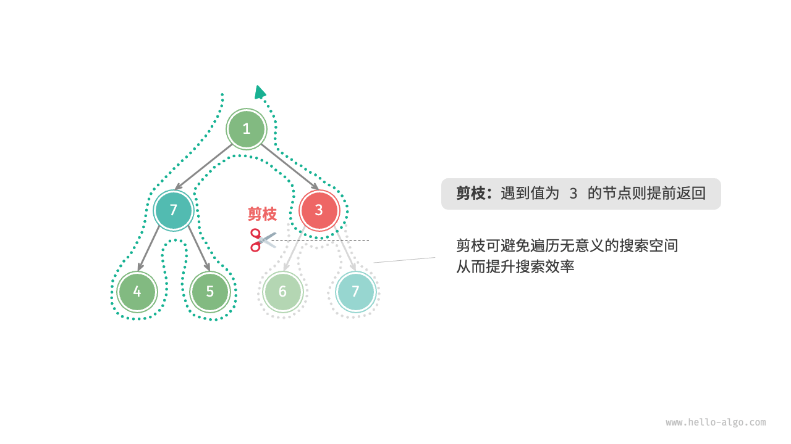
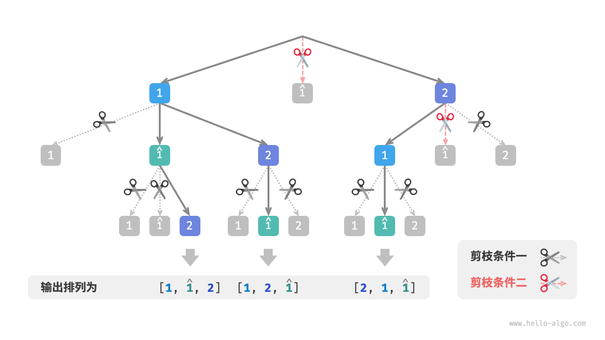
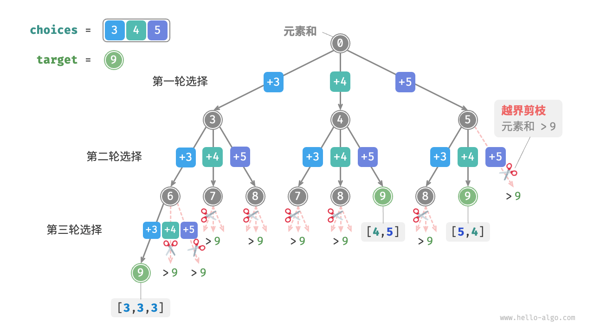

# 概念
## 定义
本质是穷举，核心思想是从一个初始状态除法，暴力搜索所有可能的解决方案，遇到正确的解记录，直到找到解或者尝试所有可能无法找到解  
经常使用深度优先搜索  

<!-- more -->

## 复杂度分析
见[回溯复杂度分析.md](%E5%9B%9E%E6%BA%AF%E5%A4%8D%E6%9D%82%E5%BA%A6%E5%88%86%E6%9E%90.md)

## 尝试与回退
经常使用这两个策略，遇到某个状态无法前进就撤销上一步选择  
例如，`给定一棵二叉树，搜索并记录所有值为7的节点，请返回节点列表。`
```java
/* 前序遍历：例题一 */
void preOrder(TreeNode root) {
    if (root == null) {
        return;
    }
    if (root.val == 7) {
        // 记录解
        res.add(root);
    }
    preOrder(root.left);
    preOrder(root.right);
}
```
访问每个节点都表示尝试，越过叶节点return表示回退  
但回退不仅仅包括函数返回
例，`在二叉树中搜索所有值为7 的节点，请返回根节点到这些节点的路径。`
```java
/* 前序遍历：例题二 */
void preOrder(TreeNode root) {
    if (root == null) {
        return;
    }
    // 尝试
    path.add(root); //path 需要在外部定义
    if (root.val == 7) {
        // 记录解
        res.add(new ArrayList<>(path));
    }
    preOrder(root.left);
    preOrder(root.right);
    //回退，到最后遍历了root以及他的所有子节点也没找到，需要把root从path去掉
    path.remove(path.size() - 1);

    path.remove(path.size() - 1);
}
```
这里我们信仰之越的契约是：相信preOrder能处理更小规模的子树，遍历子树的root以及所有节点，并把路径添加到res，让后穷举完所有结果后回退，把path回退到之前
## 剪枝
如果有约束条件可以尝试剪枝  
例，`在二叉树中搜索所有值为7 的节点，请返回根节点到这些节点的路径，并要求路径中不包含值为3 的节点。`  
我们需要添加剪枝操作，遇到值为3的节点则提前返回不再继续找

```java
import javax.swing.tree.TreeNode;
import java.util.ArrayList;

void preOrder(TreeNode root) {
    //剪枝
    if (root == null || root.val == 3) {
        return;
    }
    //尝试
    path.add(root);
    if (root.val == 7) {
        //记录解
        res.add(new ArrayList<>(path));
    }
    //继续尝试左右边
    preOrder(root.left);
    preOrder(root.right);
    //回退
    path.remove(path.size() - 1);
}
```


## 框架代码
尝试->回退->剪枝  
state表示当前问题状态，choices表示当前状态下可做的选择

```java
import javax.swing.plaf.nimbus.State;
import java.awt.*;
import java.util.List;

void backtrack(State state, List<Choices> choices, List<State> res) {
    if (isSolution(state)) {
        recordSolution(state, res);
        //如果找到一个解就可以结束则返回
        return;
    }
    //遍历所有选择
    for (Choice choice : choices)
    {
        //判断是否需要剪枝
        if(isValid(state,choice))
        {
            //尝试：做出选择，更新状态
            makeChoice(state,choice);
            //继续深入尝试
            backtrack(state,choices,res);
            //回退：撤销选择
            undoChoice(state,choice);
        }
    }
}
```
借助框架代码解决例题

```java
import javax.swing.tree.TreeNode;
import java.util.ArrayList;
import java.util.Arrays;
import java.util.List;

boolean isSolution(List<TreeNode> state) {
    return !state.isEmpty() && state.get(state.size() - 1).val == 7;
}

void recordSolution(List<TreeNode> state, List<List<TreeNode>> res) {
    res.add(new ArrayList<>(state));
}

boolean isValid(List<TreeNode> state, TreeNode choice) {
    return choice != null && choice.val != 3;
}

void makeChoice(List<TreeNode> state, TreeNode choice) {
    state.add(choice);
}

void undoChoice(List<TreeNode> state, TreeNode choice) {
    state.remove(state.size() - 1);
}

void backtrack(List<TreeNode> state, List<TreeNode> choices, List<List<TreeNode>> res) {
    if (isSolution(state)) {
        recordSolution(state, res);
    }
    for (TreeNode choice : choices) {
        if (isValid(state, choice)) {
            makeChoice(state, choice);
            backtrack(state, Arrays.asList(choice.left,choice.right),res);
            undoChoice(state,choice);
        }
    }
}
```
## 优点与局限
本质是深度优先搜索，剪枝可以降低复杂度  
  
复杂度： 
* 时间：遍历所有可能性，复杂度可能指数阶
* 要保持当前状态（例如路径，剪枝的辅助变量）  

优化方式：  
* 剪枝
* 启发式搜索：引入策略或者估计值，优先搜索最有可能产生解的路径

# 题目
## 全排列问题
`输入一个整数数组，其中可能包含重复元素，返回所有可能的排列。`   
* **分析**  
  * 可以使用回溯，把生成排列成一系列选择的结果。  
      * choices 就是输入数组所有元素
      * state 就是已经被选择的所有元素，并且唯一（当然值可能重复，但是选取的元素唯一）
      * 剪枝  
        * 重复选择剪枝：确保每个元素只被选择一次，引入selected，selected[i]表示choices[i]是否被选择
        * 相等元素剪枝： 可以引入一个哈希集合duplicated，标记尝试过的元素  
        
        <br> 
        
        ***
        
         两种剪枝的不同


* **实现**

```java
import java.util.ArrayList;
import java.util.HashSet;
import java.util.List;

void backtrack(List<Integer> state, int[] choices, boolean[] selected, List<List<Integer>> res) {
    // 当状态长度等于元素数量时记录,就是框架代码的issolution
    if (state.size() == choices.length) {
        res.add(new ArrayList<>(state));
        //需要 返回，不可能继续下去探索了
        return;
    }
    //遍历所有选择
    Set<Integer> duplicated = new HashSet<Integer>();
    for(int i = 0; i < choices.length;i++) {
        int choice = choices[i];
        //剪枝：不允许重复选择元素 且 不允许选择相等元素
        //就是isValid
        if (!selected[i] && !duplicated.contains(choice))
        {
            //尝试做出选择，相当于makeChoice
            duplicated.add(choice); // 记录已经选择过的元素的值
            selected[i] = true; //记录被选择过的元素本身（记录索引i就行其实）
            state.add(choice);
            //进行下一轮选择
            backtrack(state,choices,selected,res);
            //回退，相当于undoChoice
            selected[i] = false;
            state.remove(state.size() - 1);
        }
    }
}

List<List<Integer>> permutations(int[] nums){
    List<List<Integer>> res = new ArrayList<>();
    backtrack(new ArrayList<>(),nums,new boolean[nums.length],res);
    return res;
}
```
* 复杂度：详见[全排列问题复杂度分析.md](%E5%85%A8%E6%8E%92%E5%88%97%E9%97%AE%E9%A2%98%E5%A4%8D%E6%9D%82%E5%BA%A6%E5%88%86%E6%9E%90.md)
  * 时间复杂度：O(n * n!)
  * 空间复杂度: O(n^2)


## 子集和问题

### 无重复情况

给定一个正整数数组 nums 和一个目标正整数 target ，请找出所有可能的组合，使得组合中的元素和等于 target 。给定数组无重复元素，每个元素可以被选取多次。请以列表形式返回这些组合，列表中不应包含重复组合。

***

**分析**
1. 可以直接参考全排列问题。但集合元素可以无限次选取，因此不必借助selected
    ```java
    /* 回溯算法：子集和 I */
    void backtrack(List<Integer> state, int target, int total, int[] choices, List<List<Integer>> res) {
        // 子集和等于 target 时，记录解
        if (total == target) {
            res.add(new ArrayList<>(state));
            return;
        }
        // 遍历所有选择
        for (int i = 0; i < choices.length; i++) {
            // 剪枝：若子集和超过 target ，则跳过该选择
            if (total + choices[i] > target) {
                continue;
            }
            // 尝试：做出选择，更新元素和 total
            state.add(choices[i]);
            // 进行下一轮选择
            backtrack(state, target, total + choices[i], choices, res);
            // 回退：撤销选择，恢复到之前的状态
            state.remove(state.size() - 1);
        }
    }
    
    /* 求解子集和 I（包含重复子集） */
    List<List<Integer>> subsetSumINaive(int[] nums, int target) {
        List<Integer> state = new ArrayList<>(); // 状态（子集）
        int total = 0; // 子集和
        List<List<Integer>> res = new ArrayList<>(); // 结果列表（子集列表）
        backtrack(state, target, total, nums, res);
        return res;
    }
    ```
    但这样比如输入[3,4,5]和目标9，会输出[3,3,3] [4,5] [5,4],因为搜索过程的全排列是区分顺序的，但实际上的子集合是不区分顺序的，如图

2. 于是考虑剪枝  
   1. 当第一轮选择[3,4]时会生成如[3,4……]这样的所有子集，
   2. 之后第一轮选择4，第二轮如果选择3,就产生[4,3……],显然重复了，应当剪去
    
    因为每一次都是从左向右尝试，因此越靠右侧剪掉的越多  
   **总之，只要让每次选择的元素索引$i_n,满足i_1<=i_2<=……<=i_n$,即可保证不重复，不满足的应当剪枝**
3.  除此之外，还进行两个优化
	1.  开启搜索前可以先把nums排序，这样遍历所有选择时，只要子集和超过target直接结束循环。因为后面元素更大，子集和一定超过target
	2.  省去total，直接通过对target进行减法，total为0记录解
**实现**

```java
import java.util.ArrayList;
import java.util.List;

void backtrack(List<Integer> state, int target, in[] choices, int start, List<List<Integer>> res) {
    //子集和等于target时记录解
    if (target == 0) {
        res.add(new ArrayList<>(state));
        return;
    }
    //遍历所有选择
    //剪枝：从start开始遍历，防止生成重复子集
    for (int i = start; i < choices.length; i++) {
        //剪枝：如果子集和超过target，直接结束循环
        //因为数组已经排序，小的尝试已经超过，后面大的没必要继续尝试
        if (target - choices[i] < 0) {
            break;
        }
        // 尝试：做出选择，相当于makeChoice
        state.add(choices[i]);
        //继续探索,契约是相信backtrack能处理更小规模的问题，同时已经剪枝，在探索完后回退
        backtrack(state, target - choices[i], choices, i, res);
        //回退
        state.remove(state.size() - 1);
    }
}

List<List<Integer>> subsetSumI(int[] nums,int target)
{
    List<Integer> state = new ArrayList<>();
    Arrays.sort(nums);
    int start = 0;
    List<List<Integer>> res = new ArrayList<>();
    backtrack(state,target,nums,start,res);
    return res;
}
```
* 时间复杂度： O(n^(target/min))，详见[回溯复杂度分析.md](%E5%9B%9E%E6%BA%AF%E5%A4%8D%E6%9D%82%E5%BA%A6%E5%88%86%E6%9E%90.md)，实际上就是递归树的节点总数 * 每个节点的操作数
* 空间复杂度: O(target)

### 考虑重复元素
`给定一个正整数数组 nums 和一个目标正整数 target ，请找出所有可能的组合，使得组合中的元素和等于 target 。给定数组可能包含重复元素，每个元素只可被选择一次。请以列表形式返回这些组合，列表中不应包含重复组合。`
1. 显然我们要进行向相等元素剪枝。`由于数组是已排序的，因此相等元素都是相邻的。这意味着在某轮选择中，若当前元素与其左边元素相等，则说明它已经被选择过，因此直接跳过当前元素。`
2. 每个元素只能选一次，也可以用start约束：选择$x_i后，下一轮直接从i+1开始遍历就行$    


**实现**

```java
import java.util.ArrayList;
import java.util.List;

void backtrack(List<Integer> state, int target, int[] choices, int start, List<List<Integer>> res) {
    //isSolution
    if (target == 0) {
        res.add(new ArrayList<>(state));
        return;
    }
    //遍历所有选择
    //剪枝二：从start开始，避免重复子集
    for(int i = start;i < choices.length;i++)
    {
        //剪枝1：子集和查过target，则直接结束
        if(target - choices[i] < 0)
        {
            break;
        }
        //剪枝四：如果元素和左边的相等，说明选取了想等元素跳过
        if (i > start && choices[i] == choices[i-1])
        {
            continue;
        }
        //做出选择
        state.add(choices[i]);
        backtrack(state,target - choices[i],choices,i+1,res); // i+1相当于剪枝三：避免选择重复元素
        //回退
        state.remove(state.size() - 1);
    }
}
List<List<Integer>> subsetSumII(int[] nums,int target){
    List<Integer> state = new ArrayList<>();
    Array.sort(nums);
    int start = 0;
    List<List<Integer>> res = new ArrayList<>();
    backtrack(state,target,nums,start,res);
    return res;
}
```
综合：

时间复杂度（含输出）：O(n log n + 2^n + mL)。给出统一最坏上界可写成 O(n · 2^n)。
辅助空间复杂度（不含结果集）：递归深度和当前路径 O(n)。若计入结果集，需再加 O(mL)。

* 时间复杂度： 递归树最大深度是n，每层的选择是从n递减，但是每个路径深度不一定是n，可能提前结束。应该考虑每个元素都有两种可能，选择或者不选择，一共有$2^n$数量级个节点，每次遍历的操作量可以认为是O(1)(递归调用不算)，一共遍历了O(2^n)(因为要找到遍历所有可能所有节点)，复制解的操作，每次复制一个解的操作最差是O(n),最坏情况下可能几乎每个路径都有解，O(n*2^n),因此最终就是O(n*2^n) 
  *    排序成本：Arrays.sort(nums) 是 O(n log n)。
  *    遍历成本（不算拷贝解）：回溯树中每个元素至多“选/不选”，最坏节点数 O(2^n)。重复剪枝只降低常数，不改变指数级上界。所以遍历是 O(2^n)。
  *   输出成本（拷贝解）：每找到一个解要拷贝 O(L)（L 为解的长度，L ≤ n）。设解的个数为 m，则拷贝总成本 O(mL)。最坏情况下 m 可达 O(2^n)，于是 O(mL) ≤ O(n · 2^n)。
  * 因此总成本O(n*2^n)
* 空间复杂度：调用栈O(N) + state O(n)最终就是O(N)

## n皇后问题
根据国际象棋的规则，皇后可以攻击与同处一行、一列或一条斜线上的棋子。给定n 个皇后和一个 n*n大小的棋盘，寻找使得所有皇后之间无法相互攻击的摆放方案。     
1. n*n 的棋盘有n^2个格子，就是choices。逐个放置皇后时每个每个时刻棋盘就是state
2. 考虑逐行放置：由于皇后数量和棋盘行数都是n，因此棋盘每行只允许放一个皇后。  
   实际上也起到了剪枝的效果，避免同一行有多个皇后的所有搜索分支
3. 列和对角线剪枝  
   * 列：利用一个长度为n的布尔型数组cols记录每一列是否有皇后
   * 对角线，主对角线索引row - col为恒定值；次对角线row + col为恒定值。可以构造两个分别以行列和差的布尔数组代表每个对角线是否有皇后，长度2n-1

```java
import java.util.ArrayList;
import java.util.List;

void backtrack(int row, int n, List<List<String>> state, List<List<List<String>>> res, boolean[] cols, boolean[] diags1, boolean[] diags2) {
    //isSolution,所有行放置完，记录解
    if (row == n) {
        List<List<String>> copyState = new ArrayList<>();
        for(List<String> sRow : state)
        {
            copyState.add(new ArrayList<>(sRow));
        }
        res.add(copyState);
        return;
    }
    //遍历所有的列
    for(int col = 0;col < n;col++)
    {
        //计算格子对应的主对角线和次对角线
        int diag1 = row - col + n -1;
        int diag2 = row + col;
        //剪枝：不允许列、对角线存在皇后
        if( !col[col] && !diags1[diag1] && !diags2[diag2])
        {
            //尝试:makechoice
            state.get(row).set(col,"Q");
            cols[col] = diags1[diag1] = diags2[diag2] = false;
            //继续放置
            backtrack(row + 1,n,state,res,cols,diags1,diags1);
            //回退
            state.get(row).set(col,"#");
            cols[col] = diags1[diag1] = diags2[diag2] = false;
        }
    }
}

List<List<List<String>>> nQueens(int n)
{
    List<List<String>> state = new ArrayList<>();
    for(int i = 0;i < n;i++)
    {
        List<String> row = new ArrayList<>();
        for(int j = 0;j < n;j++){
            row.add("#");
        }
        state.add(row);
    }
    boolean[] cols = new boolean[n]; //记录列是否有皇后
    boolean[] diags1 = new boolean[2*n-1];
    boolean[] diags2 = new boolean[2*n-1];
    backtrack(0,n,state,res,cols,diags1,diags2);
    return res;
}
```

* 时间复杂度：从第一行到最后一行依次有n,n-1……1个选择，递归树也就一共O(n!)个路径（或者说叶子节点）,复制添加操作O(n^2)，因此最终复杂度是O(n! +s* n^2)(s是解的数目)
* 空间复杂度：
  * 递归深度 O(n)；三组布尔数组 O(n) 与 O(2n-1)。
  * 棋盘状态 state 为 n×n，O(n^2)。
  * 结果集存储占用 O(S·n^2)（按当前拷贝方式）。
  * 综合（不计输出）：O(n^2)；计入输出：O(n^2 + S·n^2)。
