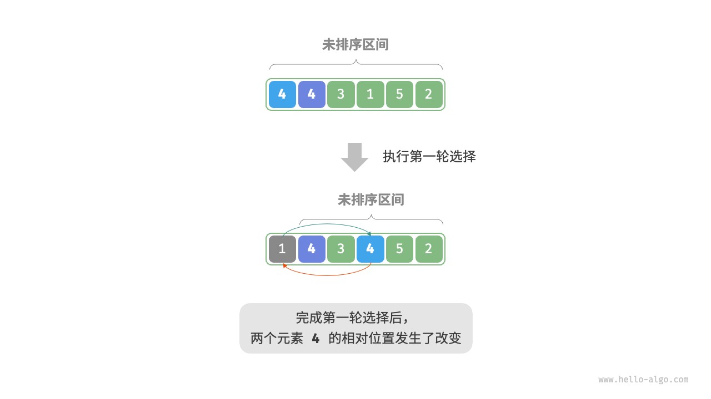
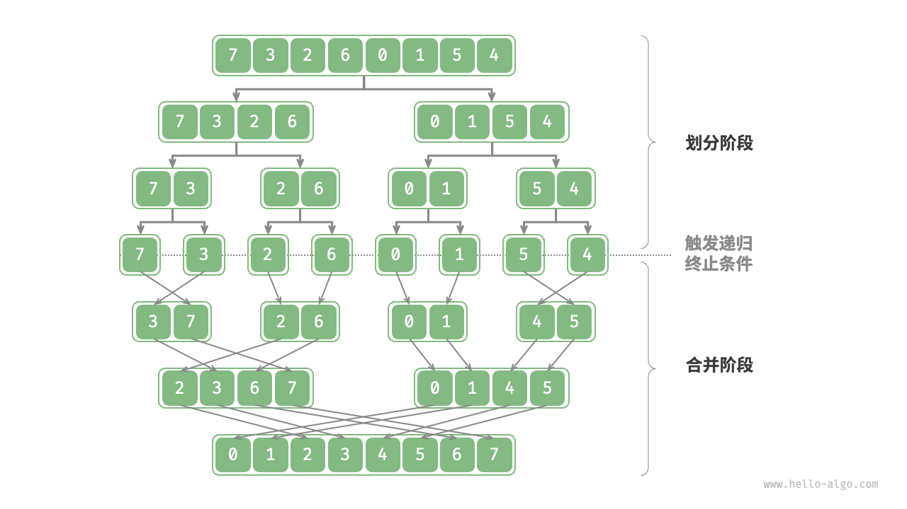
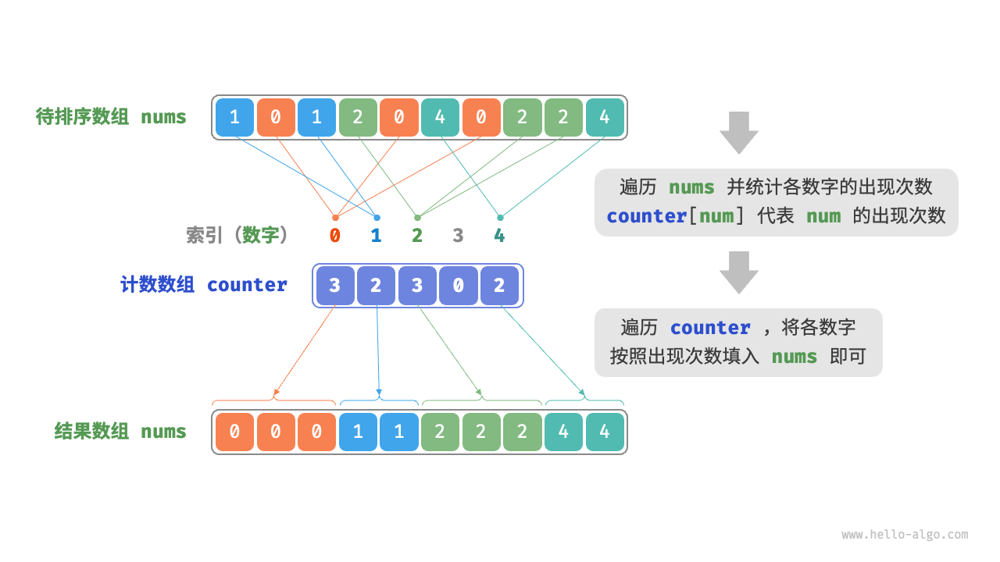
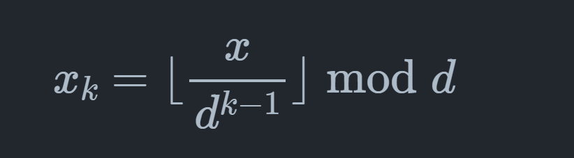
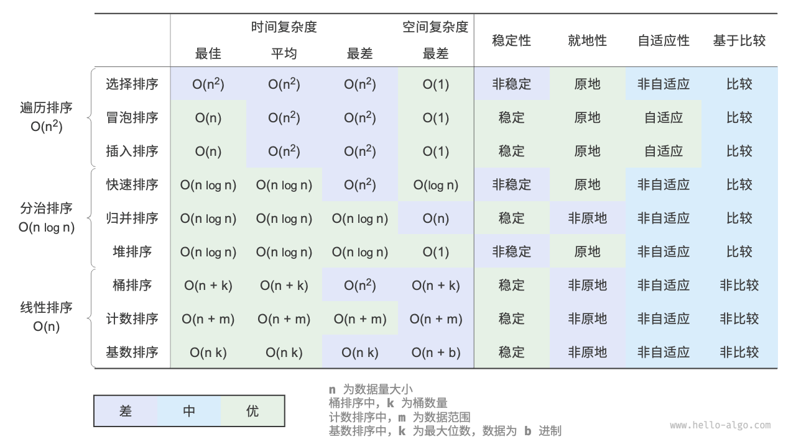

# 评价维度
* 运行效率（时间复杂度，还有常数项也尽可能小）
* 就地性（原地排序再原数组直接操作不必借助辅助数组，节省内存）
* 稳定性（排序前后相等元素相对位置不变）
* 自适应性（利用输入数据的信息减少计算量，达到更优）
* 是否基于比较（基于比较的依赖于">,<,=",理论最优时间复杂度是(O(nlogn)；非比较排序不用比较运算符，速度快但通用性差)
<br>
**目前没有发现上面所有都好的算法**

<!-- more -->

# 选择排序
```java
/* 选择排序 */
void selectionSort(int[] nums) {
    int n = nums.length;
    // 外循环：未排序区间为 [i, n-1]
    for (int i = 0; i < n - 1; i++) {
        // 内循环：找到未排序区间内的最小元素
        int k = i;
        for (int j = i + 1; j < n; j++) {
            if (nums[j] < nums[k])
                k = j; // 记录最小元素的索引
        }
        // 将该最小元素与未排序区间的首个元素交换
        int temp = nums[i];
        nums[i] = nums[k];
        nums[k] = temp;
    }
}
```
特点：
* 时间复杂度O(n方)，非自适应。(n-1)到2求和
* 空间复杂度O(1),原地排序。
* 非稳定性排序

# 冒泡
```java
/* 冒泡排序（标志优化） */
void bubbleSortWithFlag(int[] nums) {
    // 外循环：未排序区间为 [0, i]
    for (int i = nums.length - 1; i > 0; i--) {
        boolean flag = false; // 初始化标志位
        // 内循环：将未排序区间 [0, i] 中的最大元素交换至该区间的最右端
        for (int j = 0; j < i; j++) {
            if (nums[j] > nums[j + 1]) {
                // 交换 nums[j] 与 nums[j + 1]
                int tmp = nums[j];
                nums[j] = nums[j + 1];
                nums[j + 1] = tmp;
                flag = true; // 记录交换元素
            }
        }
        if (!flag)
            break; // 此轮“冒泡”未交换任何元素，直接跳出
    }
}
```
* 时间复杂度O(n*n),优化后是自适应排序。(n-1)到1求和
* 空间复杂度O(1)，原地排序
* 稳定性排序

# 插入排序
类似整理扑克牌，从未排序区间选一个基准元素，把ta和左侧已排序区间逐一比较并插入到正确地方

```java
/* 插入排序 从小到大*/
void insertionSort(int[] nums) {
    //外循环，已经排序的区间是[0,i-1]
    for (int i = 1;i< nums.length;i++)
    {
        int base = nums[i],j = i - 1;
        //把base插入已排序区间的合适位置
        while(j >= 0 && nums[j] > base)
        {
            /*
           把比base大的元素都向右移动，
           因为我们已经存取了索引为i的元素为base，所以不必担心覆盖
             */
            nums[j+1] = nums[j];
            j--;
        }
        //循环结束时，j索引一定是第一个不大于base的元素
        //原本的j+1索引的元素是第一个大于base的元素，已经向右移动了
        //因此直接插入在j+1即可
        nums[j + 1] = base;
    }
}
```
* 时间复杂度O(n*n),自适应性。1加到(n-1)。遇到有序数组时，内循环（插入操作）会提前终止，达到最佳复杂度O(n).
* 空间复杂度O(1),原地排序。
* 稳定排序。插入时我们插入在相等元素右侧。

**虽然复杂度是O(n*n),但数据量小时可能比快排更快**<br><br>
#### 实践中插入排序使用频率高于冒泡和选择
* 冒泡： 基于元素交换，涉及3个单元操作，插入排序基于元素赋值，只需要一个单元操作
* 选择： 不自适应，任何时候都是O(n*n),

# 快速排序
基于分治策略<br>
核心是**哨兵划分**：目标是选择数组某个元素作为基准数，将所有小于基准数的元素移到左侧，大于的移到右侧。
<br>
```java
void swap(int[] nums,int i,int j){
    int temp = nums[i];
    nums[i] = nums[j];
    nums[j] = temp;
}
/*哨兵划分*/
int partition(int[] nums,int left,int right){
    //我们以nums[left]为基准
    int i = left , j = right;
    while (i < j){
        while(i < j && nums[j] >= nums[left]){
            j--;//从右向左找首个小于基准数的
        }
        while (i<j && nums[i] <= nums[left]){
            i++;//从左向右找到首个大于基准数的
        }
        swap(nums,i,j);
    }
    // 最终i，j一定相等，作为分界线
    swap(nums,i,left);
    return i; 
}
```
---
注意，当我们选取左侧的元素为基准时，只能先从右往左查找！<br>
 **正确顺序：先从右往左查找**

在这种模式下，循环的逻辑是：
1.  `j` 指针从右向左移动，直到找到一个小于 `key` 的数，然后停下来。
2.  `i` 指针从左向右移动，直到找到一个大于 `key` 的数，然后停下来。
3.  交换 `nums[i]` 和 `nums[j]`。
4.  重复以上过程，直到 `i` 和 `j` 相遇。

**为什么这能成功？**
因为 `j` 的任务是找到一个“小数”，而 `i` 的任务是找到一个“大数”。当循环结束，`i` 和 `j` 相遇时，相遇点 `i` 的值必然是小于等于基准数 `key` 的。这有两种情况：
*   **情况一**：`j` 先移动，找到了一个小数停下，然后 `i` 再移动，直到与 `j` 相遇。这意味着相遇点 `i`（也就是 `j` 的位置）的元素就是 `j` 找到的那个小数，它必然小于 `key`。
*   **情况二**：在某次交换后，`j` 开始向左移动，但它还没找到小数，`i` 就已经和它相遇了。这说明 `i` 和 `j` 相遇点及其右边的所有元素，都已经被 `j` 扫描过并确认是大于等于 `key` 的。而 `i` 停在当前位置，是因为它左边的元素都小于等于 `key`。因此，`i` 和 `j` 相遇的这个位置，是经过 `i` 指针扫描确认的小于等于 `key` 的区域的右边界。

无论哪种情况，**只要是 `j` 指针的循环先启动，就能保证当 `i` 和 `j` 相遇时，它们所在的位置的元素是 `j` 筛选过的，必然小于等于 `key`**。这样，最后一步 `swap(nums[left], nums[i])` 就能成功地将一个较小的数换到最左边，而基准数被换到了中间的正确位置。

---

 **错误顺序：先从左往右查找**

现在我们交换顺序，让 `i` 指针先从左往右查找。
1.  `i` 指针从左向右移动，直到找到一个大于 `key` 的数，然后停下来。
2.  `j` 指针从右向左移动，直到找到一个小于 `key` 的数，然后停下来。
3.  交换 `nums[i]` 和 `nums[j]`。
4.  重复以上过程，直到 `i` 和 `j` 相遇。

**为什么这会失败？**
问题就出在当 `i` 和 `j` 相遇时，相遇点的元素 `nums[i]` 可能是大于 `key` 的。

我们用你提到的例子 `[0, 0, 0, 0, 1]` 来走一遍流程：
*   **基准数** `key = nums[0] = 0`。`i` 从索引 0 开始，`j` 从索引 4 开始。

1.  **先动 `i`**：`i` 从左向右查找大于 `0` 的数。
    *   `i` 移动到索引 4 时，`nums[4]` 是 `1`，大于 `0`。`i` 停在 4。
2.  **再动 `j`**：`j` 从右向左查找小于 `0` 的数。
    *   此时 `i` 已经是 4，`j` 也是 4，`i < j` 的条件不满足，`j` 不会移动。
3.  **循环结束**：`while(i < j)` 循环因为 `i` 等于 `j` 而终止。此时 `i` 和 `j` 相遇在索引 4。
4.  **最后交换**：执行 `swap(nums[left], nums[i])`，也就是交换 `nums[0]` 和 `nums[4]`。
    *   数组从 `[0, 0, 0, 0, 1]` 变成了 `[1, 0, 0, 0, 0]`。

**问题分析**：
因为是 `i` 指针先移动并找到了一个“大数”（`1`）而停下，而 `j` 指针因为 `i` 已经到达了它的位置而没有机会再去寻找“小数”，导致 `i` 和 `j` 最终相遇在了一个大于基准数的位置上。最后一步交换，就把这个“大数”换到了数组的最左边，破坏了分区的正确性。[[1](https://www.google.com/url?sa=E&q=https%3A%2F%2Fvertexaisearch.cloud.google.com%2Fgrounding-api-redirect%2FAUZIYQHbdtVWJwirlBZMh2uktWns2d-8VnZNlqt7A0pvAV6waWCDjny1brKFEYM82L-seP8N9vpGtZLhF8RR6ImJ6zHiL6ZYxuFa290pBnHwH-FPe-puvS3LplIkHzv8hXkwfYBD-U5h-uYKJ7Eo9rT6jw%3D%3D)][[2](https://www.google.com/url?sa=E&q=https%3A%2F%2Fvertexaisearch.cloud.google.com%2Fgrounding-api-redirect%2FAUZIYQGzPOXfIUWwVJROO75yk8ZkcAzQGc0yO1nAWTd-rYjZwf9RU5NmCEbySHTzUvVCTbEIMt0Jg6YRLxD4_mNdJ-hOZ_yV6PXh4adGAqEAjMcVziCXsiveFvs83ixWlM5pfUjF0TBcgCyfKb_n1MDt4g%3D%3D)]

---
总之，最终达到左边子数组任意元素<=基准数<=右边子数组
```java
void quickSort(int[] nums,int left,int right){
    //基本情况，如果数组长度为1天然有序
    if(left >= right){
        return;
    }
    //基于分治策略，把一个长数组划分成两个短数组。
    //有两个作用：1.把pivot放在正确的顺序索引上
    //         2.左边子数组任意元素<=基准数<=右边子数组

    int pivot = partition(nums,left,right);
    //分别排序pivot左右两侧的数组
    quickSort(nums,left,pivot-1);
    quickSort(nums,pivot+1,right);
    //最终左右两侧，pivot自己都有序
}
```
* 平均时间复杂度O(nlongn)，非自适应：平均情况下递归层数为logn,每层中操作数为O(n)(主要是哨兵划分，各个子数组操作之和)。
<br>但最差时(哨兵选取的是最大或者最小的元素时），每轮哨兵划分都分为长度为0和n-1的子数组，递归层数会达到n，复杂度达到O(n*n).
* 空间复杂度O(n),原地排序：递归深度最差达到n(哨兵选取的是最大或者最小元素时)。直接操作员数组，没有借助额外空间
* 非稳定性：partition的最后一步，把基准元素调换到分界线时可能改变和基准元素相等的元素的相对位置

## 优化
### 基准数选取优化
下面是一种方法，选取首、尾、中点的中位数。
<br>
我们要把选取的基准数调换到最左侧，这样可以直接复用代码，直接仿照上面的哨兵划分即可
```java
/* 选取三个候选元素的中位数 */
int medianThree(int[] nums, int left, int mid, int right) {
    int l = nums[left], m = nums[mid], r = nums[right];
    if ((l <= m && m <= r) || (r <= m && m <= l))
        return mid; // m 在 l 和 r 之间
    if ((m <= l && l <= r) || (r <= l && l <= m))
        return left; // l 在 m 和 r 之间
    return right;
}
/* 哨兵划分（三数取中值） */
int partition(int[] nums, int left, int right) {
    // 选取三个候选元素的中位数
    int med = medianThree(nums, left, (left + right) / 2, right);
    // 将中位数交换至数组最左端，之后就可以直接复用上面的代码了
    swap(nums, left, med);
    // 以 nums[left] 为基准数
    int i = left, j = right;
    while (i < j) {
        while (i < j && nums[j] >= nums[left])
            j--;          // 从右向左找首个小于基准数的元素
        while (i < j && nums[i] <= nums[left])
            i++;          // 从左向右找首个大于基准数的元素
        swap(nums, i, j); // 交换这两个元素
    }
    swap(nums, i, left);  // 将基准数交换至两子数组的分界线
    return i;             // 返回基准数的索引
}

```

### 递归深度优化
最差空间复杂度优化为O(logn):即便在基准数选取最大或者最小值时也保证O(logn)
<br>
我们可以只对划分出来的短子数组进行递归，长子数组利用迭代在下次循环处理。
```java
void quickSort(int [] nums , int left ,int right){
    while(left<right){//基本情况隐含了，子数组长度小于等于直接返回
        int pivot = parition(nums,left,right);
        if(pivot - left < right - pivot){
            quickSort(nums,left,pivot-1);
            left = pivot + 1;//左子数组被排序过了，这是新的未排序的左边界
        }
        else{
            quickSort(nums,pivot + 1,right);
            right = pivot - 1;//右子数组被排序过了，这是新的未排序的右边界
        }
    }
}
```
由于每次较短的子数组必定小于等于n/2,因此这种方法递归深度必然不超过O(logn)
<br>
最差空间复杂度优化为O(logn)

### 分区优化
当数组中所有元素都相等时，快速排序的时间复杂度是O(n^n)
<br>
对于这种情况，可以考虑通过哨兵划分将数组划分为三个部分：小于、等于、大于基准数。仅向下递归小于和大于的两部分。在该方法下，输入元素全部相等的数组，仅一轮哨兵划分即可完成排序。


# 归并排序
也基于分治策略，
<br>
1. 划分阶段：用递归将数组从中点处分开
2. 合并阶段：数组长度为1时停止开始合并

<br>
归并排序的顺序和二叉树的后序遍历类似。
* 后序遍历：先递归左子树，再递归右子树，最后处理根节点
* 归并排序：先递归左子树组，再递归右子树组，最后处理合并
```java
void merge (int[] nums,int left,int mid,int right)
{
    //左子数组区间时[left,mid],右子树组是[mid+1,right]
    //temp存放合并后的结果
    int [] temp = new int[right - left +1];
    int i = left,j = mid+1,k = 0;
    //当左右数组都有元素时，进行比较并把较小的元素复制到数组中
    while (i <= mid && j <= right)
    {
        if(nums[i] <= nums[j])
        {
            temp[k++] = nums[i++];
        }
        else {
            temp[k++] = nums[j++];
        }
    }
    //当任意一个数组元素被遍历完后，把剩余元素复制到临时数组
    while (i<=mid)
    {
        temp[k++] = nums[i++];
    }
    while (j <= right)
    {
        temp[k++] = nums[j++];
    }
    //将temp复制回原数组对应区间
    for(k = 0;k< temp.length;k++)
    {
        nums[left + k] = temp[k];
    }
}

/*归并排序*/
void mergeSort(int[] nums,int left,int right)
{
    //基本情况
    if(left >= right)
    {
        return;
    }
    int mid = left + (right - left)/2;
    //相信mergeSort能处理更小规模的
    //先对左侧归并排序
    mergeSort(nums,left,mid);
    //堆右侧归并排序
    mergeSort(nums,mid+1,right);
    //最后把左右子数组进行合并
    merge(nums,left,mid,right);
}
```
* 时间复杂度O(nlogn)、非自适应。递归高度logn,每层一共的合并操作都是n
* 空间复杂度O(n)、非原地排序。递归调用栈O(logn),合并操作的辅助数组O(n).
* 稳定排序（我们先处理了左侧的子数组）

# 堆排序
一个简单的方法是输入数组建立小顶堆，之后不断执行出堆操作，一次记录出堆元素
<br>
但这样空间复杂度高，我们可以优化成原地排序
<br>
1. 输入数组建立大顶堆。完成后最大元素位于堆顶
2. 把堆顶元素（首个）和堆底元素（最后一个元素）交换。交换后堆的长度减去1，已排序元素加一
3. 从堆顶开始执行从顶到底堆化。
4. 重复2、3。循环n-1轮即可排序成功

```java
void siftDown(int[] nums,int n,int i){
    while(true)
    {
        int l = 2*i +1;
        int r = 2*i + 2;
        int ma = i;
        if(l < n && nums[l] > nums[ma])
        {
            ma = l;
        }
        if(r < n && nums[r] > nums[ma])
        {
            ma = r;
        }
        if (ma == i)
        {
            break;
        }
        int temp = nums[i];
        nums[i] = nums[ma];
        nums[ma] = temp;
        i = ma;
    }
}
```
注意，自顶向下堆化要求除了要处理的当前节点及其子节点外，剩余部分的子树都满足堆的性质。
```java
/*堆排序*/
void heapSort(int[] nums){
    //建堆
    for( int i = nums.length/2 - 1 ;i>= 0;i--)
    {
        siftDown(nums,nums.length,i);
    }
    //从堆中提取最大元素，循环n-1轮
    for(int i = nums.length - 1;i>0;i--)
    {
        int temp = nums[0];
        nums[0] = nums[i];
        nums[i] = temp;
        siftDown(nums,i,0);//i是索引中最后的元素，本来就是数组长度-1，因此首次循环无需先减去1
    }
}
```
* 时间复杂度O(nlogn)、非自适应排序<br>
log(n-1) + log(n-2) + …… + log2,我们在之后证明这个求和的渐进上限就是O(nlogn)
* 空间复杂度O(1)、原地排序
* 非稳定性排序：交换堆顶和堆底时，相等元素相对位置可能变化

下面我们来证明log(n-1) + ……+log2的渐进上限是O(logn)
1. 显然和s<=nlogn
2. 之后我们把s分两半，log(2)到log(n/2),和log(n/2+1)到log(n-1)，后一半是nlogn,因此s>=nlogn

## 实际上快速排序一般更快
1. 出现最坏情况的概率很低 
快速排序的最坏情况时间复杂度是 O(n²)，这种情况发生在每次选择的基准值（pivot）都是当前数组中的最大或最小值时，例如对一个已经排好序的数组进行排序。
然而，这种情况在实际应用中非常罕见。通过随机选取基准值或使用“三数取中”等方法，可以极大地避免最坏情况的发生。在绝大多数情况下，快速排序都能在 O(n log n) 的时间复杂度下高效运行。
2. 缓存使用效率高 
现代计算机的内存结构是分级的（CPU -> Cache -> Memory）。CPU访问缓存的速度远快于访问主内存。
快速排序在分区（partition）操作时，是对一个连续的数组块进行操作。这使得数据可以被加载到高速缓存中，从而提高访问效率。 这种访问模式被称为“局部性原理”（principle of locality）。
相比之下，像堆排序这样的算法需要跳跃式地访问元素（例如，访问父节点和子节点，它们在内存中可能相距很远），这降低了缓存的命中率，从而导致实际运行时间变慢。
3. 复杂度的常数系数小 
算法的时间复杂度（如 O(n log n)）描述的是随着数据规模 (n) 增长的趋势，但忽略了常数项。在实际计算中，这个常数项代表了完成基本操作（如比较、交换）所需的具体时间。
在上述三种算法中，快速排序完成一次内循环所需要的比较、赋值、交换等操作的总数量是最少的。 这意味着在相同的 n log n 级别下，快速排序的实际执行时间更短。这与“插入排序”比“冒泡排序”更快的原因类似，尽管它们的复杂度在最坏情况下都是O(n²)，但插入排序的内部操作更少。

# 桶排序
采取分治策略
<br>
设置一些具有一定大小顺序的桶，每个桶对应一个数据范围，把数据平均分配到各个桶中，之后在每个桶内部排序，最后按照桶的顺序把所有数据合并

```java
import java.util.ArrayList;
import java.util.Collection;
import java.util.List;

void bucketSort(float[] nums) {
    //初始化k = n/2，预期向每个桶分配2个元素
    int k = nums.length / 2;
    List<List<Float>> buckets = new ArrayList<>();
    for (int i = 0; i < k; i++) {
        buckets.add(new ArrayList<>());
    }
    //把元素平均分配到各个桶
    for (float num : nums) {
        int i = (int) (num * i);
        buckets.get(i).add(num);
    }
    // 对每个桶排序
    for (List<Float> bucket : buckets) {
        Collection.sort(bucket);
    }
    int i = 0;
    for(List<Float>bucket : buckets)
    {
        for(float num : bucket)
        {
            nums[i++] = num;
        }
    }
}
```
* 时间复杂度：O(n + k):在平均分布的情况下，排序单个桶O((n/k) *log(n/k)),k个桶就是O(nlog(n/k)),当k很大，趋近于O(n)。合并结果时，每轮循环操作数O(1+n/k),一共k轮循环花费O(n+k)。但最差情况下所有数据分配到一个桶，复杂度可能是O(nlogn)
* 空间复杂度：O(n + k),非原地排序
* 稳定性取决于排序每个桶内的算法是否稳定
<br>
**桶排序重要的是要尽可能使元素平均分布**

# 计数排序
假定数组都是非负整数

先找到原数组最大数字m,创建长度m+1辅助数组counter,借助counter统计nums各个数字出现次数，由于counter索引天然有序，之后遍历counter把数字填入nums
```java
//注意这个实现不能排序对象
void countingSortNative(int[] nums)
{
    //统计最大元素m
    int m = 0;
    for(int num : nums)
    {
        m = Math.max(m , nums);
    }
    //统计各个数字出现次数
    int[] counter = new int[m+1];
    for(int num : nums)
    {
        counter[num]++;
    }
    //遍历counter，把元素填入原数组
    int i = 0;
    for(int num = 0;num < m+1;num++)
    {
        for(int j = 0;j < counter[num];j++,i++)
        {
            nums[i] = num;
        }
    }
}
```
我们可以将计数排序中的计数数组 counter 的每个索引视为一个桶，将统计数量的过程看作将各个元素分配到对应的桶中。本质上，计数排序是桶排序在整型数据下的一个特例。
<br>
但是上述实现无法对对象排序。如果强行对对象排序，会只得到排序所依据的属性的顺序
<br>
我们可以计算前缀和来完整实现。
<br>
前缀和就是小于等于i的元素之和，我们用prefix数组记录
<br>
于是prefix[i] - 1就是最右侧元素应该在的索引
<br>
最后倒序遍历原数组nums,依据每个元素对应的prefix放到res对应的位置，之后让prefix减一，最后把res复制到原数字即可

```java
void countingSort(int[] nums)
{
    int m = 0;
    for(int num : nums)
    {
        m = Math.max(m,num);
    }
    int[] counter = new int[m + 1];
    for(int num : nums)
    {
        counter[num]++;
    }
    //计算前缀和
    for(int i = 0;i < m;i++)
    {
        counter[i+1] += counter[i];
    }
    //倒序遍历并且填入res
    int n = nums.length;
    int[] res = new int[n];
    for(int i = n - 1;i >= 0; i--)
    {
        int num = nums[i];
        res[counter[num] - 1] = num;
        counter[num]--;
    }
    for(int i = 0; i < n;i++)
    {
        nums[i] = res[i];
    }
}
```
* 时间复杂度O(n + m),非自适应：m是最大的数
* 空间复杂度O(n+m),非原地排序
* 稳定排序
计数排序只适用于非负整数（其他的可以转换），适用于数据量大但是范围小的情况

# 基数排序
位数从低到高，分别以每位为键进行计数排序。
<br>
*   **低位排序是为高位排序服务的**：当我们按十位排序时，所有十位相同的数字，它们的相对顺序实际上是由个位决定的，而个位在第一步已经排好了。
*   **稳定性是秩序的“守护者”**：稳定性保证了低位排序的成果不会被高位排序破坏掉。它确保了当高位相同时，低位已经建立的秩序得以保留。
*   **层层递进的秩序**：当排到第 `k` 位时，所有数字的后 `k` 位其实都已经是有序的了。当最后排完最高位时，整个数字自然就是完全有序的。

可用下图公式获取d进制数字的第k位

````java
/*获取元素第k位，其中exp = 10^(k-1)*/
int digit (int num , int exp)
{
    //传入exp避免重复次方运算
    return (num/exp) % 10;
}
/*计数排序，根据nums第k位排序*/
void countingSortDigit(int[] nums, int exp){
    int[] counter = new int[10];
    int n = nums.length;
    //统计0~9出现个数
    for(int i = 0; i< n;i++){
        int d = digit(nums[i],exp);
        counter[d]++;
    }
    //求前缀和
    for(int i = 1;i<10;i++)
    {
        counter[i] += counter[i-1];
    }
    //倒序遍历
    int[] res = new int [n];
    for(int i = n -1;i>=0;i--)
    {
        int d = digit(nums[i],exp);
        int j = counter[d] - 1;
        res[j] = nums[i];
        counter[d]--;
    }
    for(int i = 0;i < n;i++)
    {
        nums[i] = res[i];
    }
    
}

/*基数排序*/
void radixSort(int[] nums)
{
    int m = Integer.MIN_VALUE;
    for(int num : nums)
    {
        if(num > m)
        {
            m = num;
        }
    }
    for(int exp = 1;exp <= m ;exp *= 10)
    {
        countingSortDigit(nums,exp);
    }
}
````
* 时间复杂度：O(nk),非自适应：对某一位排序是O(n+d),排序所有k位是O((n+d)k),一般n >> d,可以近似为O(nk).一般情况下，n,k都是小常数，复杂度可以为O(n).
* 空间复杂度：O(n + d),要借助res和counter数组
* 稳定排序：计数排序稳定基数就稳定

# 总结
