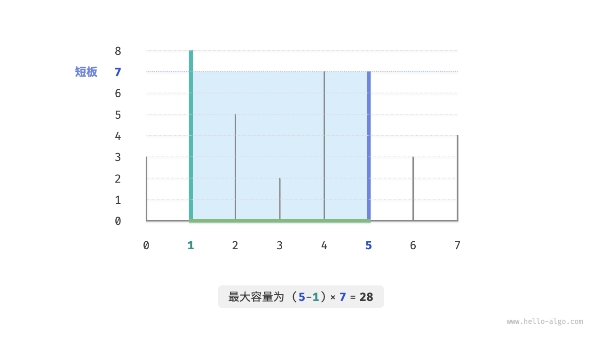
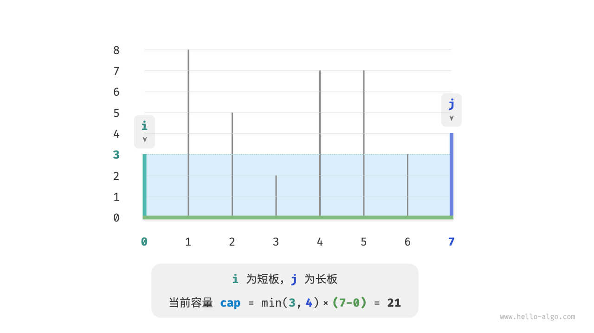

# 定义
在问题的每个决策阶段，都选择当前看起来最优的选择，即贪心地做出局部最优的决策，以期获得全局最优解。

<!-- more -->


和动态规划有相似，都依赖最优子结构，但原理不同：

1. 动态规划根据之前截断所有决策考虑当前决策，使用过去子问题的解构建当前子问题的解
2. 贪心不考虑过去的决策，一路向前进行贪心选择不断缩小问题范围

# 优点和局限性
1. 优点：简单，效率高
2. 确定：没有证明的情况下无法保证一定找到正确答案

# 适用
1. 可以保证找到最优解
2. 可以找到近似最优解（次优解，同时问题允许次优解）

# 特性
1. 贪心选择性质： 只有局部最优始终可以全局最优，才能保证得到最优解
2. 最优子结构：原问题的最优解包含子问题的最优解

# 解题步骤
1. 问题分析：梳理与理解问题特性，包括状态定义、优化目标和约束条件等。这一步在回溯和动态规划中都有涉及
2. 确定贪心策略：确定如何在每一步中做出贪心选择。这个策略能够在每一步减小问题的规模，并最终解决整个问题。
3. 正确性证明：通常需要证明问题具有贪心选择性质和最优子结构。这个步骤可能需要用到数学证明，例如归纳法或反证法等。

# 例题引入
给定 $n$ 种硬币，第 $i$ 种硬币的面值为 $coins[i - 1]$ ，目标金额为 $amt$ ，每种硬币可以重复选取，问能够凑出目标金额的最少硬币数量。如果无法凑出目标金额，则返回 $-1$ 。

这个题用动态规划可以严谨的解答，但我们尝试一下贪心

可以贪心的选择不大于且最接近的硬币

```java
/* 零钱兑换：贪心 */
int coinChangeGreedy(int[] coins, int amt) {
    // 假设 coins 列表有序
    int i = coins.length - 1;
    int count = 0;
    // 循环进行贪心选择，直到无剩余金额
    while (amt > 0) {
        // 找到小于且最接近剩余金额的硬币
        while (i > 0 && coins[i] > amt) {
            i--;
        }
        // 选择 coins[i]
        amt -= coins[i];
        count++;
    }
    // 若未找到可行方案，则返回 -1
    return amt == 0 ? count : -1;
}
```
这个时间复杂度降低到了O(amt/min(coins))  
但是某些组合不成立，比如[1,20,50].三个20才是最优解，贪心的结果会是50+1*10，一共十个硬币

# 题目
## 分数背包问题
给定 $n$ 个物品，第 $i$ 个物品的重量为 $wgt[i-1]$、价值为 $val[i-1]$ ，和一个容量为 $cap$ 的背包。每个物品只能选择一次，**但可以选择物品的一部分，价值根据选择的重量比例计算**，问在限定背包容量下背包中物品的最大价值。示例如下图所示。

1. 和0-1背包很像，装填包含当前物品i和容量c，目标是最大价值，但是这个允许选择物品的一部分   

可以引入单位重量的价值：val[i-1] / wgt[i - 1]  

2. 贪心策略确定
最大化背包内物品总价值，实际上本质就是最大化单位重量下的物品价值
    1. 单位价值从低到高排序
    2. 遍历，每轮贪心的选择单位价值最高的
    3. 如果容量不足填入部分
3. 实现：可以先构造一个Item类

```java
import java.awt.event.ItemEvent;
import java.util.Arrays;
import java.util.Comparator;

class Item {
    int w;
    int v;

    public Item(int w, int v) {
        this.w = w;
        this.v = v;
    }
}

double fractionalKnapsack(int[] wgt, int[] val, int cap) {
    Item[] items = new Item[wgt.length];
    for (int i = 0; i < wgt.length; i++) {
        items[i] = new Item(wgt[i], val[i]);
    }
    Arrays.sort(items, Comparator.comparingDouble(item -> -((double)item.v/item.w)));
    double res = 0;
    for(Item item : items)
    {
        if(item.w <= cap)
        {
            res += item.v;
            cap -= item.w;
        }else {
            res += (double) item.v/ item.w * cap;
            return ;
        }
    }
    return res;
}
```
时间复杂度O(nlogn),空间复杂度O(n)

4. 正确性证明
反证法：   

**核心思想**：如果存在一个比贪心解更优的“最优解”，那么这个最优解一定可以通过“交换”，变得和贪心解更像，并且价值还能变得更高。但这与“最优解”的定义相矛盾。

**证明步骤：**

1.  **假设存在更优解**：
    假设我们的贪心策略（永远优先装单位价值最高的物品）得到的解是 `G`。同时，假设存在一个不完全遵循此策略，但价值却比 `G` 更高的最优解，我们称之为 `O`。

2.  **找到第一个分歧点**：
    既然解 `O` 和解 `G` 不一样，那么必然存在某个物品，它们装入的重量不同。我们按单位价值从高到低检查所有物品，找到**第一个** `G` 和 `O` 装入重量不同的物品，记为物品 `i`。
    *   根据贪心策略，`G` 会尽可能多地装入物品 `i`。因此，`G` 中物品 `i` 的重量必然**大于** `O` 中物品 `i` 的重量。

3.  **分析最优解 `O` 的构成**：
    *   解 `O` 少装了单位价值较高的物品 `i`，但为了达到最优（甚至超过 `G`），它必然在**某个单位价值更低的物品 `j`** 上，装入了比 `G` 更多的重量。

4.  **执行“替换”操作**：
    *   现在我们来调整“最优解” `O`：从 `O` 中取出一小部分单位价值较低的物品 `j`，用等量的单位价值较高的物品 `i` 来替换。
    *   由于 `O` 中 `j` 有富余，`i` 有空缺，这个替换操作是完全可行的。

5.  **得出矛盾**：
    *   因为物品 `i` 的单位价值**高于**物品 `j`，这个替换操作在总重量不变的情况下，**必然会使总价值增加**。
    *   这意味着，我们刚刚把所谓的“最优解 `O`”变得更优了。这与 `O` 本身就是最优解的假设相矛盾！

**结论**：因此，最初的假设（存在一个比贪心解更优的解）是错误的。贪心策略得到的解就是最优解。

## 最大容量问题
输入一个数组 $ht$ ，其中的每个元素代表一个垂直隔板的高度。数组中的任意两个隔板，以及它们之间的空间可以组成一个容器。

容器的容量等于高度和宽度的乘积（面积），其中高度由较短的隔板决定，宽度是两个隔板的数组索引之差。

请在数组中选择两个隔板，使得组成的容器的容量最大，返回最大容量。示例如下图所示。



**分析**
1. 容器由任意两个隔板围城，因此本题状态就是两个隔板的索引，记为[i,j]
2. 容量等于短板高度×索引差。因此cap[i,j] = min(ht[i],ht[j])*(j-i)。这个显然可以暴力遍历，时间复杂度O(n^2)
3. 贪心策略：  
    
    选取一个状态[i,j],满足索引i<j,并且先暂定ht[i] < ht[j]  
    如果此时将长板j向向短板i靠近，则容量一定会减小  
    因为，移动长板j后，宽度一定减小，但是高度由短板决定，高度只能不变或者变小。  
    所以能得到，想要容量变大必须向内收缩短板i，才有可能使容量变大。  
    可以得到贪心策略的执行过程：
        1. 初始状态，i,j指针分列数组两端
        2. 计算当前的cap[i,j]
        3. 比较板i和j的高度，短板向内移动一格
        4. 循环执行2.和3.，直到i和j相遇
4. 循环最多n轮，时间复杂度O(n),空间复杂度O(1)  
    i,j,res,使用O(1)的空间
```java
int maxCapacity(int[] ht)
{
    //初始化i，j
    int i =0,j = ht.length-1;
    int res = 0;
    while (i < j){
        int cap = Math.min(ht[i],ht[j]) * (j - i);
        res = Math.max(res,cap);
        if(ht[i] < ht[j])
        {
            i++;
        }
        else {
            j--;
        }
    }
    return res;
}
```
正确性证明：  
贪心比穷举快是因为每轮都会跳过一些状态，实际上跳过的就是长板向内移动的状态，这样前面已经说过容量肯定变小，因此被跳过的状态都不可能是最优解，跳过并不会导致错过最优解。


## 最大切分城际问题
给定一个正整数 $n$ ，将其切分为至少两个正整数的和，求切分后所有整数的乘积最大是多少。
1. 贪心策略  
    1. 假设从n分出一个2，2(n-2)在n>=4时一定大于n，说明n大于等于4时，切分出一个2后乘积变大，说明大于等于4的整数都应该切分，最终因子只剩1,2,3
    2. 接下来，看看1，2，3因子哪个最优。显然1最差，1*(n-1)必定乘积减小，1应该和其他因子合并；当n = 6时，3*3>2*2*2，意味着如果由3个二应当合并成两个3     
   
    因此最终，
    1. 输入整数n，不断切分因子3直到剩余余数0，1，2
    2. 余数为0不必处理
    3. 余数为2，不继续划分保留
    4. 余数为1，由于2*2>1*3，将最后一个3换成2
2. 实现   
不必循环切分，直接整除3得3的个数，对3取模得余数，不过当n<=3时必须拆分一个1，乘积为1*(n-2)
```java
int maxProductCutting(int n)
{
    if(n <= 3)
    {
        return 1*(n-1);
    }
    int a = n/3;
    int b = n%3;
    if(b == 1){
        return (int)Math.pow(3,a-1)*2*2;
    }
    if(b == 2)
    {
        return (int)Math.pow(3,a)*2;
    }
    return (int)Math.pow(3,1);
}
```

正确性证明：  
反证法，分析n>=4：
1. 所有因子<=3:假设存在大于等于4的因子x，一定能进一步分为2(x-2)，从而获得更大或者相等的乘积
2. 不包含1：假设包含1，1可以融合进其他因子，可以获得更大的乘积
3. 做多包含两个2：如果有3个2，一定可以替换成两个3.