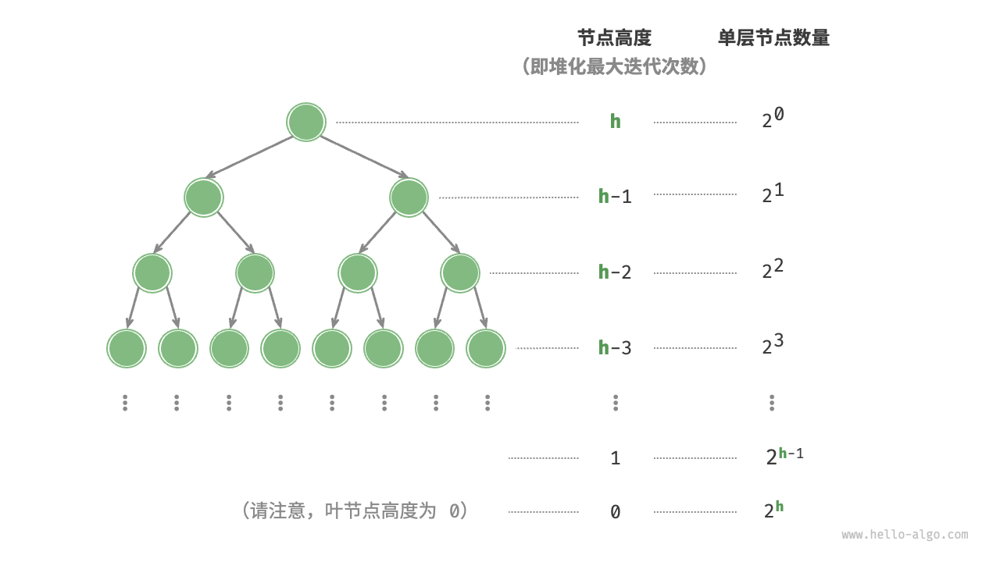

# Heap
因为堆是完全二叉树，我们可以尝试用数组
<br>
下面以大顶堆为例
<br>

<!-- more -->

## 入堆：先把元素加到堆底，之后从低至顶堆化（冒泡即可）
```java
void push(int val)
{
    maxHeap.add(val);
    siftUp(size() - 1);
}
void siftUp(int i)
{
    while (true)
    {
        int p = parent(i);
        if(p<0 || maxHeap.get(i) <= maxHeap.get(p))
        {
            break;
        }
        swap(i,p);
        i = p;
    }
}
```
显然一次入堆操作时间复杂度是O（logn),空间复杂度除了储存原本的堆外是O(1)
<br>
## 出堆
一般先交换堆顶和堆底，之后删除堆底（实际上是原来的堆顶），之后从根节点开始自顶置底堆化
<br>
自顶至底堆化：根节点和两个子节点比较，把最大的子节点和根节点交换，迭代至叶节点或者某个无需交换的节点
```java
int pop(){
    if(isEmpty())
    {
        throw new IndexOutOfBoundsException();
    }
    swap(0,size() - 1);
    int val = maxHeap.remove(size() - 1);
    siftDown(0);
    return val;
}
void siftDown(int i)
{
    while(true){
        int l = left(i),r = right(i),maxNode = i;
        if(l < size() && maxHeap.get(l) > maxHeap.get(maxNode))
        {
            maxNode = l;
        }
        if(r < size() && maxHeap.get(r) > maxHeap.get(maxNode))
        {
            maxNode = r;
        }
        if(maxNode == i)
        {
            break;
        }
        swap(i,maxNode);
        i = maxNode;
    }
}
```
**注意很多语言优先队列就是堆**
## 建堆操作
1. 依次入堆法，时间复杂度O(nlogn)
<br>
2. 遍历堆化：先把列表元素直接加入堆，再倒叙遍历堆对每个非叶子点进行 从顶至底堆化

```java
import java.util.ArrayList;
import java.util.List;

MaxHeap(List<Integer> nums) {
    maxHeap = new ArrayList<>(nums);
    for(int i = parent(size() -1);i>=0;i--)
    {
        siftDown(i);
    }
}
```
复杂度是个差比数列求和：<br>
以完美二叉树为例：每层高度记为h，h-1 … 0，单层节点数量则是2^0,2^1 ……2^h;<br>
求和得最终是O(2^h),即为O(n).
## Top-k 问题
给定一个长度为n 的无序数组 nums ，请返回数组中最大的k 个元素。
### 遍历
k遍历，每轮找到一个当前最大，时间复杂度O(nk)
### 排序
先排序再取前k个，O(nlogn)
### 堆
先初始化一个小顶对；前k个元素入堆；k+1个开始，如果当前元素大于堆顶则堆顶出堆当前元素入堆；遍历完后堆中的就是k个元素

```java
import java.util.PriorityQueue;
import java.util.Queue;

Queue<Integer> topKHeap(int[] nums, int k) {
    Queue<Integer> heap = new PriorityQueue<>();
    for(int i = 0; i< k;i++)
    {
        heap.offer(nums[i]);
    }
    for(int i = k;i<nums.length;i++)
    {
        if (nums[i] > heap.peek())
        {
            heap.poll();
            heap.offer(nums[i]);
        }
    }
    return heap;
}

```
时间复杂度O（nlogk）。<br>
时间复杂度：<br>
初始堆构建：我们遵循每次循环最悲观的操作作为单次操作量，就是log(k),因此第一部分就是O（klogk)
<br>
同时大概想一下，再k/2前后开始的复杂度就是log(k)，有超过一半的操作数是这个，因此我们找的上届是合理的
<br>
后续： O((n-k)log(k))
<br>
因此最终求和后就是O(nlog(k))